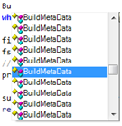

Unlike what I mentioned in my previous post, I ended up trying Boo first. I will delve on the reason in another post. The objective of this post is to document the problems I had getting used to Boo syntax. None of the problems were big, just some missing punctuations :) And I did not face any issues with the significant space.

### Empty array vs. Empty list

An empty list is

```
[]
```

and an empty map is

```
{}
```

And empty array is

```
(,)
```

as it would cause ambiguity with a function / closure.

### Type declaration vs. Initialisation

_Declaration:_

\_myDict as Dictionary\[**of string**, **object**\]

_Initialisation:_

\_myDict \= Dictionary\[**of string**, **object**\]**()**

### Assigning a Type vs. invoking a function

When you are calling a function don't forget the brackets at the end.

_Wrong:_

fs \= file.OpenRead

_Correct:_

fs \= file.OpenRead()

If you make this mistake you will get errors like:

'<method/property>' is not a member of '<some type>'. (BCE0019)

**Colon is the new semicolon**

Remember the times when a missing semicolon used to be causing most compile errors, well, in boo it will be the missing colon which signifies a beginning of a block.

_Wrong:_

**while** ((line \= filestream.ReadLine()) != **null**)

m.parse(line)

_Correct:_

**while** ((line \= filestream.ReadLine()) != **null**):

m.parse(line)

If you forget the colon, you will get an error like:

`Unexpected token: m. (BCE0043) Unexpected token: <INDENT>. (BCE0043) expecting "EOF", found '<DEDENT>'. (BCE0044)`

### Function definition in a script file

Maybe a no-brainer for python gurus, but if you have a script file, i.e. a file with no class, just instructions; functions are to be defined near the top of the script and called after it is def'ed.

### You can't mix Boo with C# in same project

This is my mistake, but looking at samples having groovy and java files in same project; I blindly assumed that the same applies to Boo as well.

### Intellisense / auto-complete does not work well.

Given the dynamic nature of Boo and maybe some bugs in SharpDevelop, it is not a great experience if you rely heavily on intellisense.



### Embedding special characters in a string

Boo follows the python way of embedding special characters in string and not c#.

Wrong:

s \= @"C:\\path\\to\\dir\\"

Correct:

s \= """C:\\path\\to\\dir\\"""

### Embedding values in strings

The syntax is slightly weird, but useful nonetheless. You need to use both $ and enclose the variable in curly braces.

print "processing ${dir.Name}"

### Still can't find a way to pattern match and assign in the same line

I think this is possible, but I can't figure a way to match a strung and assign the values to 2 variables.

I am trying to do something like, below and a few variations without luck:

key, val \= /(?<key>\[^=\\s\]+)\\s\*=\\s\*"(?<value>.+)"\\s\*$/.Match(line)

If the regex would have been simpler I could have used the Split instead of Match and things would have worked.

I ended up with something like:

data \= /(?<key>\[^=\\s\]+)\\s\*=\\s\*"(?<value>.+)"\\s\*$/.Match(line)

key, val \= data.Groups\["key"\].Value, data.Groups\["value"\].Value

### Embedding spaces in a regular expression patterns

As seen in the regex sample above, take extra care when you want to match a space. Use \\s instead of a literal space.
