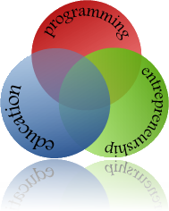

Hi, this is Hitesh. I am here to talk about stuff I like. How do I know what I like? Well I asked myself the same question and like any true geek looked at the data at hand to decide. So I analysed my bookmarks at delicious and the three areas that interest me way beyond others are programming, education and entrepreneurship.

Thus the focus of this blog will remain these three areas of my interest. My plan is to add at least one post per week, let's see how it goes.

Once again, Hello world!
