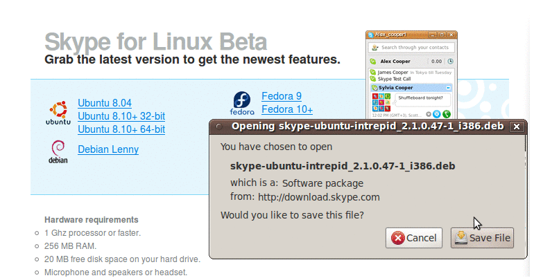
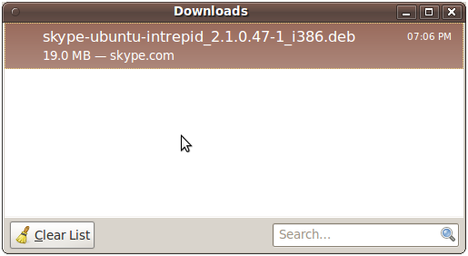
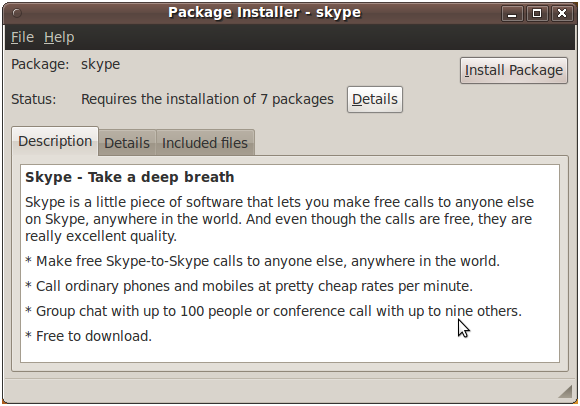
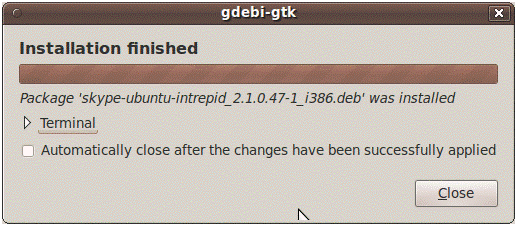
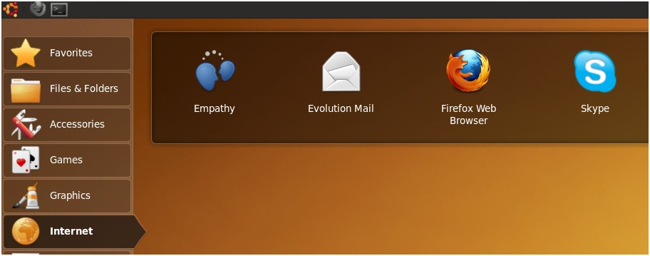
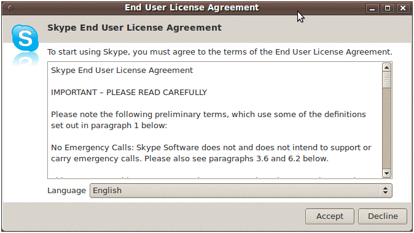
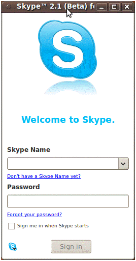

While analysing my visitor logs, I noticed several people come here looking for a way to install Skype on an EeePC running Ubuntu Netbook Remix. So here it is.

### Step 1.

Download the [skype installer](http://www.skype.com/go/getskype-linux-beta-ubuntu-32). The package for Ubuntu 8.10 works well on 9.10 as well.

### Step 2.

When download completes, double click to run the _deb_ file. This will launch the package installer.

### Step 3.

Click the "Install package" button.

### Step 4.

When the installation is finished, click 'Close'.

### Step 5.

Go to Internet section and run Skype.

### Step 6.

Accept license agreement

### Final Step.

Login and you are done.

It couldn't be easier!
