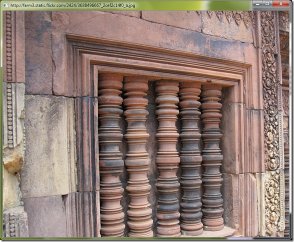

Yesterday I stumbled upon [SmallBasic](http://www.smallbasic.com/), while looking for something else. It is an interesting little project by Microsoft to create an entry level language to teach programming. It is a mix of toned down [BASIC](http://en.wikipedia.org/wiki/BASIC) and [Logo](http://en.wikipedia.org/wiki/Logo_%28programming_language%29). Since the language (or is it an application) is still in infancy, [version 0.5 released recently](http://blogs.msdn.com/smallbasic/archive/2009/06/16/the-newest-leanest-and-the-meanest-is-here.aspx), I will try not to be too harsh on it.

#### Sample program with obligatory screenshot

###### Showing Flickr Image

 1: url = Flickr.GetPictureOfMoment()

 2: img = ImageList.LoadImage(url) 

 3: GraphicsWindow.Title = url 

 4: GraphicsWindow.DrawImage(img,0,0) 

 5: GraphicsWindow.Height = ImageList.GetHeightOfImage(img) 

 6: GraphicsWindow.Width = ImageList.GetWidthOfImage(img)

#### The Good:

- The interface is toy like and very simple. Will surely win favours with 10 year olds.

- The limited with just 15 keywords is good too.

- The learner does not need to initialise variables, there is no `new`.

- No variable scopes, everything is global.

- Before you think it will bring forth another set of programmers, like the much maligned VB programmers, remember this is for 10 yr olds.

- In general, it feels light weight and fast.

#### The Bad

- The application itself depends on .NET 3.5 which still does not have a large installed base.

- For sake of simplicity, all libraries are more or less global objects. This approach might not scale when more libraries are added.

- The turtle is non-interactive and verbose. How I long for the good old code which went something like:

 1: FD 100 

 2: RT 90 

 3: REPEAT 4

- Same application in SmallBasic:

 1: For i=1 To 4

 2: Turtle.Move(100) 

 3: Turtle.TurnRight() 

 4: EndFor

- The result:

- 
    
      
    _Notice there is no area to type the next command, all commands to turtle have to be specified upfront._

#### The Ugly

- The syntax is very ugly. Why the curly brackets?

 1: 'You need the curly brackets for all function calls.

 2: GraphicsWindow.Show() 

 3: 'Why not drop the brackets for zero argument functions?

 4: GraphicsWindow.Show 

- The current syntax forces the learner to understand the different between a property and a function. Completely unimportant for the target audience.

- To add to that it is not consistent, you still have a few functions that have a property pattern (GetSomething, SetSomething)

- What would look better, VB.NET style or a mix of original BASIC and ruby?

#### Conclusion

I really dig for anything related to teaching programming to children. Although my daughter is too young to program, I draw from my experiences of learning programming. I, like countless others, was introduced to BASIC and Logo as the first programming language. But I was not interested in adding 2 numbers or drawing a square. I became interested in programming when I was introduced to dBase III (remember it?). When I found I could save and retrieve data and manipulate it, I was sold.

Similarly, I think, today's internet generation might be sold on network based interactivity. SmallBasic takes initial steps in that direction by having a Network object and a Flickr object. This will be a good direction to pursue and add more libraries for APIs from other web apps. [Hackety Hack](http://hacketyhack.net/) approach, I guess.

The other thing interesting to this generation is gaming and multimedia. Although [Scratch](http://scratch.mit.edu/), [Alice](http://www.alice.org/), [Phun](http://www.phunland.com/wiki/Home) and others like [Phrogram](http://phrogram.com/Default.aspx) are filling that need, a few libraries towards that end (animations, effects, sound, video), will not hurt at all.

In conclusion, I think this is a very interesting start, but needs to cover much ground, while remaining true to the promise of simplicity.
