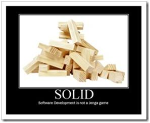

\[caption id="" align="alignright" width="297" caption="Software Developement is not a game of Janga"\]\[/caption\]

I spent last two weeks deep diving into code written by our contractors and writing some test against the same. This was a pleasant break from my regular duties of an architect. As an architect I am always trying to ensure the code follows pragmatic design principle and I really dig SOLID and TDD.

<aside>

## S.O.L.I.D. (a.k.a. S.O.L.D.I.)

The charm of [Uncle Bob](http://blog.objectmentor.com/articles/category/uncle-bobs-blatherings) is, he can give a concrete shape to abstract ideas. I have been following the principles laid out by SOLID for some time, but he makes them fit together and remove ambiguity.

So, what is SOLID principle? SOLID stands for:

[The Single Responsibility Principle](http://www.objectmentor.com/resources/articles/srp.pdf) - _A class should have one, and only one, reason to change._

> Do one thing and do it well. Haven't we heard this before?

[The Open Closed Principle](http://www.objectmentor.com/resources/articles/ocp.pdf) - _You should be able to extend a classes behaviour, without modifying it._

> You achieve this mostly by following the other principles.

[The Liskov Substitution Principle](http://www.objectmentor.com/resources/articles/lsp.pdf) - _Derived classes must be substitutable for their base classes._

> The class performing actions on the base class or any of its subclasses need not know the difference.

[The Dependency Inversion Principle](http://www.objectmentor.com/resources/articles/dip.pdf) - _Depend on abstractions, not on concretions._

> DI is the new - new :). Seriously, DI makes a big difference in testability and abstraction. You could fail at DI if you violate Liskov substitution principle. And if you do follow DI, you are mostly guaranteed to adhere to Open Close principle.

[The Interface Segregation Principle](http://www.objectmentor.com/resources/articles/isp.pdf) - _Make fine grained interfaces that are client specific._

> This one is a bit difficult to grasp, but think about it and it is simple. All it says is to "Keep is Simple". Why create an interface which has 10 methods, when the client only needs 3 of those. If you think you need 10 methods, because somewhere down the road you will need them, well, "You Ain't Gonna Need It".

</aside>

Coming back to the subject at hand, here's a summary of the two weeks.

## Week 1

I spent week one reviewing, writing test cases and refactoring a new application. This application is written on Spring Framework with a bit of secret sauce. It adheres mostly to the SOLID principles but has the tests all wrong. They violated most unit testing 'laws'. Long story short, they were integration test and not unit tests.

Created mocks and stubs, injected these into the container and then wrote unit tests using the mocks. After the exercise, I was happy with the removal of all test dependencies and that the tests ran blazing fast. As an added benefit, I could now see the code coverage and compare them build on build.

Following this, I trained the contractors. Gave them a brief overview on unit testing the right way, and then showed how it could be done. Did a pair programming session and helped them write some tests.

## Week 2

Buoyed by success of week one, I decided to attack the big hairy monster. This is a J2EE application with myriad dependences. DB, JMS, RMI, Tibco Rendezvous; you name it, you got it. The application has grown organically for 10 years and developed by multiple teams. The unit tests take 2 hours to complete! Mostly since they aren't unit tests at all.

As advised by [Michael Feathers](http://www.objectmentor.com/omTeam/feathers_m.html) in the book "Working Effectively with Legacy Code", I started by writing tests and breaking dependencies.

I was successful in breaking dependencies, but I had to perform some nasty hacks. Since the classes were not open to modification and depended directly on the J2EE container I had to mock the container. On the bright side, since EJB 1.1 and 2.0 required certain interfaces, I could easily mock the Home classes and write dummy implementations where needed.

Then I hit a million line tall code wall. This [God object](http://en.wikipedia.org/wiki/God_object) knows everything and does everything, and I mean _everything_. This is an ugly artefact in an otherwise well written application. It violates every single design principle and has a directory of who's who of anti-patterns. And the methods in the class are to be called in a particular order, else you will invite God's wrath. The methods do more than they advertised, do not throw or return errors, least cohesion, and what not.

Due to this, the tests I wrote can only validate a complete workflow and not individual steps. At least the tests are not dependent on external factors and run fast. The next task on my plate is to refactor the god object into smaller classes that follow the SOLID principles.

To do so, I am following the advice in the book "Working Effectively with Legacy Code".

Please share your advice, tips and experiences on the same.
