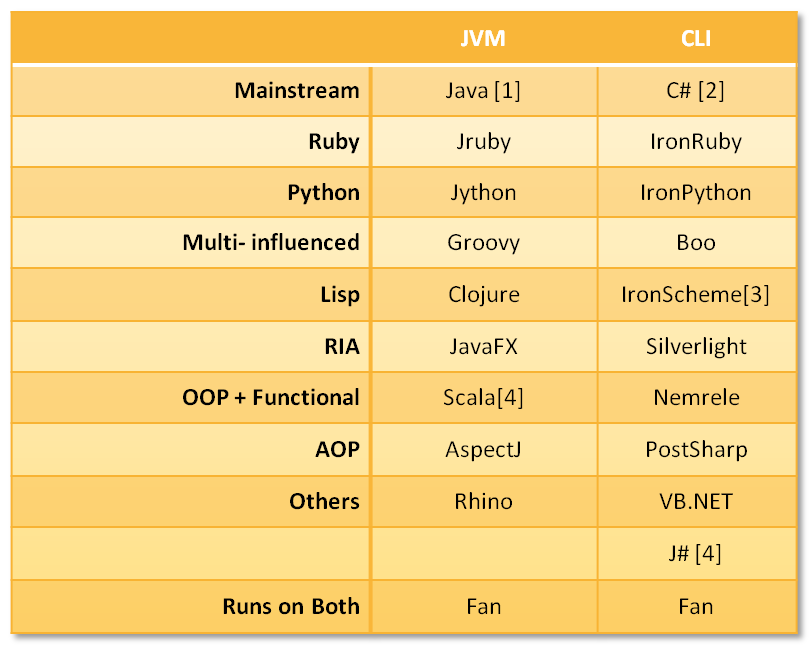

It is becoming more and more obvious that there are just two runtimes left to execute code, the _Java Virtual Machine_ (JVM) and the _Common Language Infrastructure_ (CLI). So, I decided to see how they stack up. Looks like both environments have something for everyone.

Here is a list of programming languages available on these runtimes.

1. Can run on CLI using IKVM.NET
2. Can run on JVM using Mainsoft solution
3. Not yet usable
4. Can run on CLR, but is behind the JVM implementation

The main reason for the research was to identify a new language I should pick-up. I looked at Python and Ruby, but both have some sore thumbs that I just can't stand. I really liked Boo and Groovy; they are similar to C#/Java in syntax and incorporate the good things from Python. Although I like Boo's syntax and approach more than Groovy, Groovy has a more mature implementation and ecosystem. I will try to use Groovy for some hobby project and get a feel to things.
