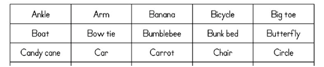
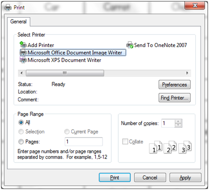
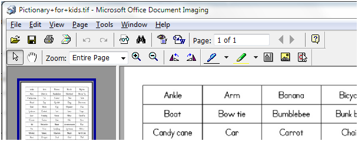
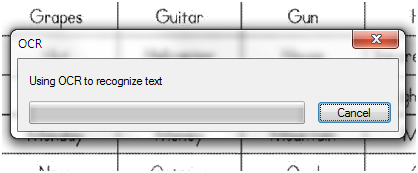

Haven't there been times when you came across some text that you could not copy or edit? It could be for a variety of reasons, whether it is a scanned copy, or an image containing text, a screen shot etc.

I came across a similar situation yesterday, when I was looking for a word list to create a Pictionary for my kid. "Stretch mark mama" had this [great list](http://stretchmarkmama.blogspot.com/2008/12/pictionary-for-kids.html); unfortunately she shared it as an image. I needed to extract the text out of the image and remembered an old trick. So I thought I would as well share it.

The trick is to use the Document Imaging application that comes with MS Office.

The list looked something like this:

I converted the jpeg file to a tiff file using [IrfanView](http://www.irfanview.com). The other option is to print the file using the _MS Document Image Writer_ printer, as shown below.

Once you have a tiff file, open it in Document Imaging application.

Click on the send to word icon (one with the little arrow and blue W), which will trigger an OCR process.

When the OCR completes, you get this output in Word:

<table border="0"><tbody><tr><td>Ankle</td><td>Arm</td><td>Banana</td><td>Bicycle</td><td>Big toe</td></tr><tr><td>Boat</td><td>Bow tie</td><td>Bumblebee</td><td>Bunk bed</td><td>Butterfly</td></tr><tr><td>Candy cane</td><td>Car</td><td>Carrot</td><td>Chair</td><td>Circle</td></tr></tbody></table>

Hope it saves your day, one day :)

Note that MDI app is not installed in the standard Office setup, so you might need to customize your setup.
