If you have come here looking for a way to install **Skype**, [visit this post](https://hitesh.in/2009/installing-skype-on-eeepc-running-ubuntu-netbook-remix-9-10/) instead.

By sheer coincidence, I got my hands on an Asus EeePC just in time for the Ubuntu 9.10 release. Given the state of Windows XP on it, I was left with no option but to do a clean install of UNR.

## Before

The netbook was virus infected and was crashing as soon as it booted. Not even the safe mode command prompt only worked! So I decided to wipe the factory installed Windows XP and install UNR instead. It did take a bit of time to find out what to be downloaded and how to install.

The guide at [https://wiki.ubuntu.com/UNR/Installation/Easy](https://wiki.ubuntu.com/UNR/Installation/Easy) suggests that the img file be downloaded, but there is no img file for the [Karmic release](http://releases.ubuntu.com/releases/9.10/). But when I landed on [this page](https://help.ubuntu.com/community/Installation/FromUSBStick), then things got rolling from there.

## Prerequisites for installing using Windows

1. Download [UNetbootin](http://unetbootin.sourceforge.net/). No installation needed
2. Download the [UNR iso](http://releases.ubuntu.com/releases/9.10/ubuntu-9.10-netbook-remix-i386.iso). Use the [torrent file](http://releases.ubuntu.com/releases/9.10/ubuntu-9.10-netbook-remix-i386.iso.torrent) if possible.
3. Have a USB stick handy
4. Run UNetBootin and create a bootable flash drive. 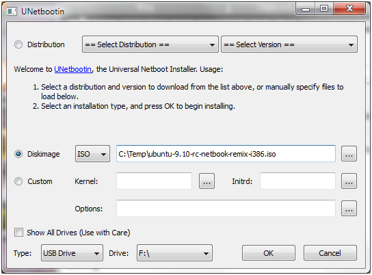
5. You are ready!

## Installing UNR

1. Insert the USB disk into EeePC
2. Press ESC when the EeePC splash screen comes
3. Select the USB disk to boot
4. Ubuntu boots up
    
    1. This was actually useful as I was able to back up the data on the netbook.
5. You can then click on the "Install Ubuntu 9.10" icon to begin the pretty straight forward installation.

## Mini pictorial review

The new interface if well thought out, but a few applications are still too big. Either they waste screen real estate or they have some dialogs that just do not fit into the tiny screen.

\[caption id="attachment\_307" align="alignnone" width="586" caption="The favorites on the home view"\][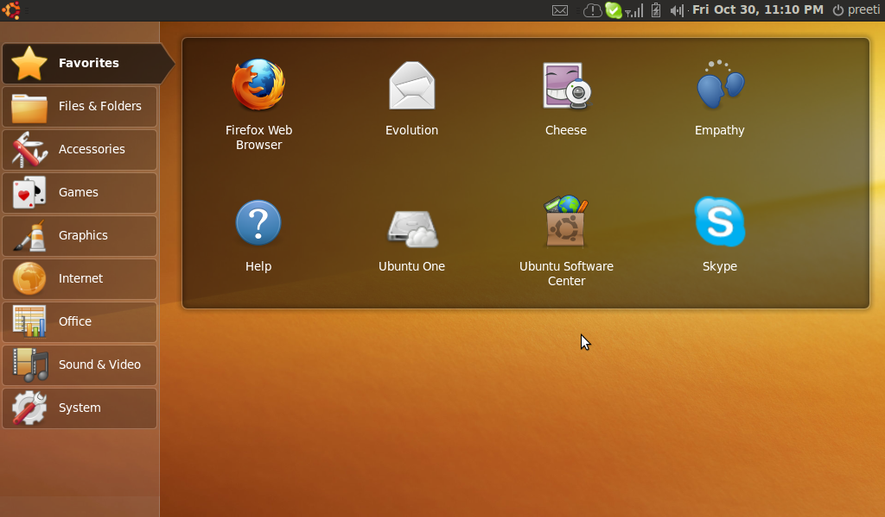](https://hitesh.in/wp-content/uploads/2009/10/favorites.png)\[/caption\]

\[caption id="attachment\_308" align="alignnone" width="586" caption="NTFS partition auto detected"\][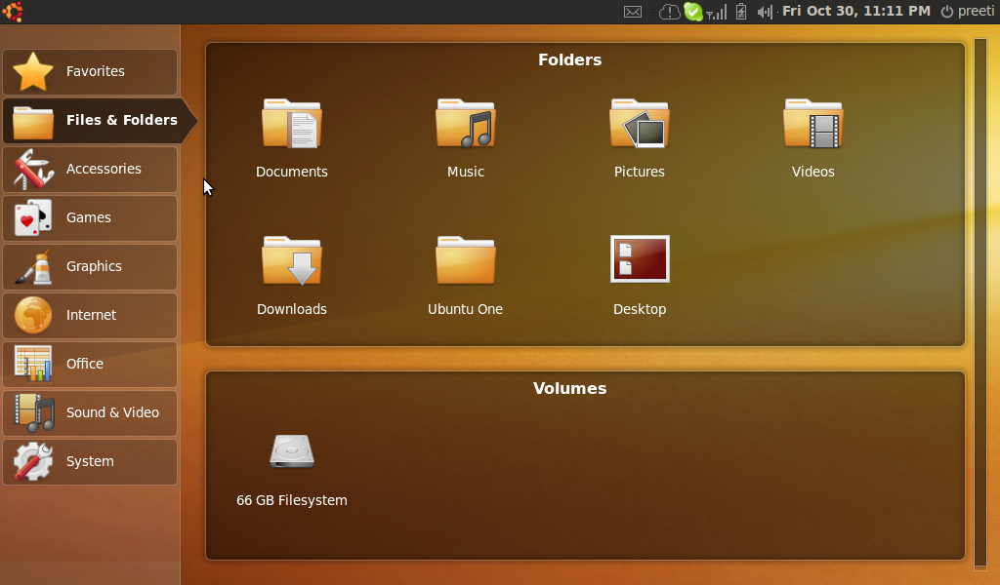](https://hitesh.in/wp-content/uploads/2009/10/files.png)\[/caption\]

\[caption id="attachment\_318" align="alignnone" width="586" caption="Painful to scroll using the tiny scrollbars"\][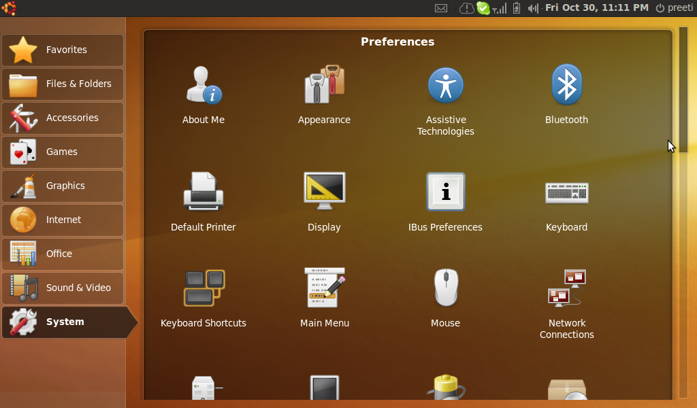](https://hitesh.in/wp-content/uploads/2009/10/System.png)\[/caption\]

\[caption id="attachment\_316" align="alignnone" width="586" caption="Installing Skype was OK. But not available in repository :("\][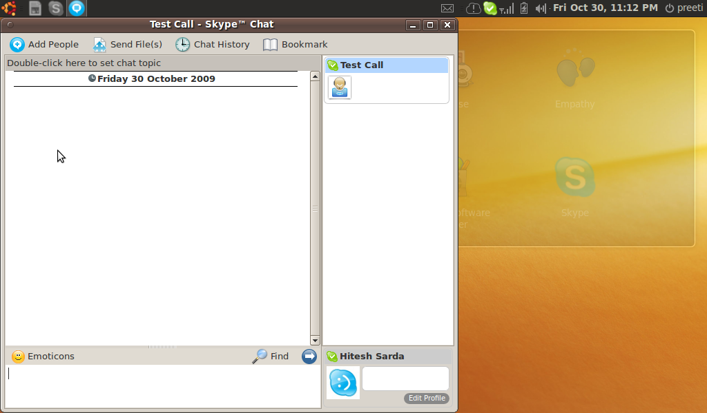](https://hitesh.in/wp-content/uploads/2009/10/skype.png)\[/caption\]

\[caption id="attachment\_317" align="alignnone" width="586" caption="The new volume notification looks good. Unfortunately other notifications were been shown too low."\]\[/caption\]

\[caption id="attachment\_309" align="alignnone" width="586" caption="Firefox was pretty usable."\][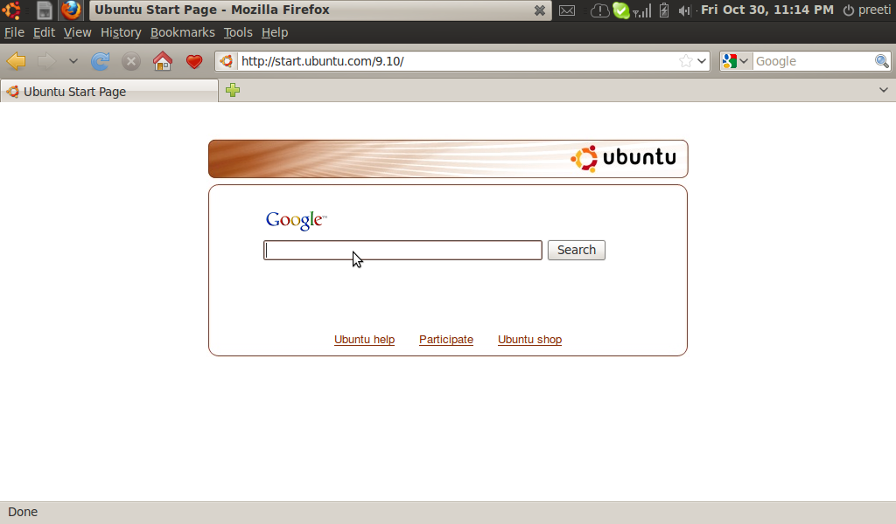](https://hitesh.in/wp-content/uploads/2009/10/firefox.png)\[/caption\]

\[caption id="attachment\_315" align="alignnone" width="586" caption="OOWriter on the other hand did not fit properly. "\][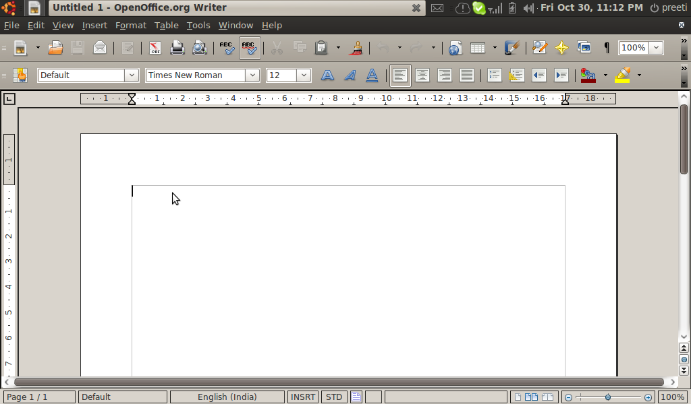](https://hitesh.in/wp-content/uploads/2009/10/oowriter.png)\[/caption\]

\[caption id="attachment\_306" align="alignnone" width="586" caption="The inbuilt webcam was detected. Above is cheese running with 2 effects on. Skype had no problems as well."\][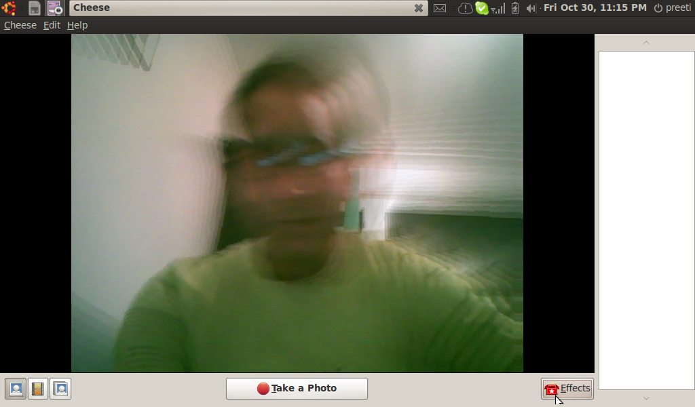](https://hitesh.in/wp-content/uploads/2009/10/cheese.png)\[/caption\]

\[caption id="attachment\_314" align="alignnone" width="586" caption="Movie Player did not come up in maximized state. A restore and maximize fixed the issue, temporarily."\][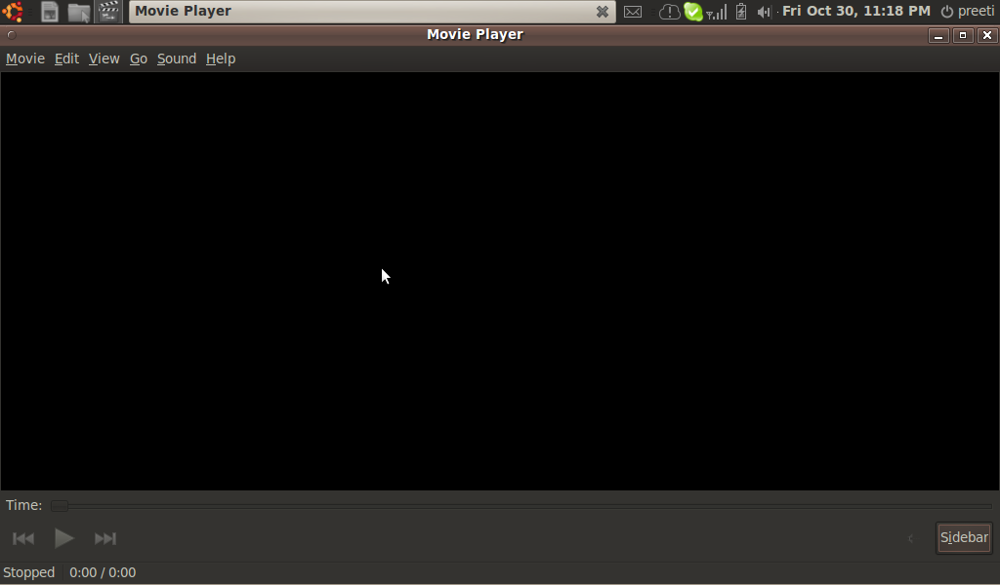](https://hitesh.in/wp-content/uploads/2009/10/movieplayer.png)\[/caption\]

\[caption id="attachment\_311" align="alignnone" width="586" caption="The splash screen mentions the blue (?) button on the top of teh screen, which was missing."\][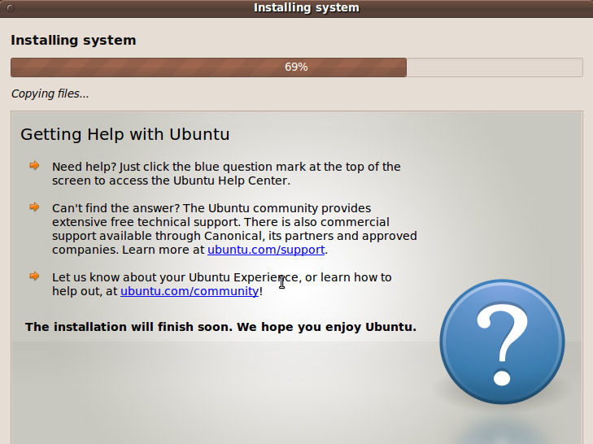](https://hitesh.in/wp-content/uploads/2009/10/installingkarmic19.png)\[/caption\]

\[caption id="attachment\_310" align="alignnone" width="586" caption="Help screen had some problems filling the available space"\][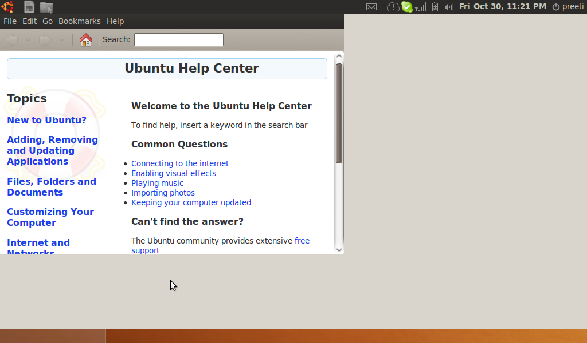](https://hitesh.in/wp-content/uploads/2009/10/help.png)\[/caption\]

\[caption id="attachment\_313" align="alignnone" width="586" caption="Help was not of much help."\][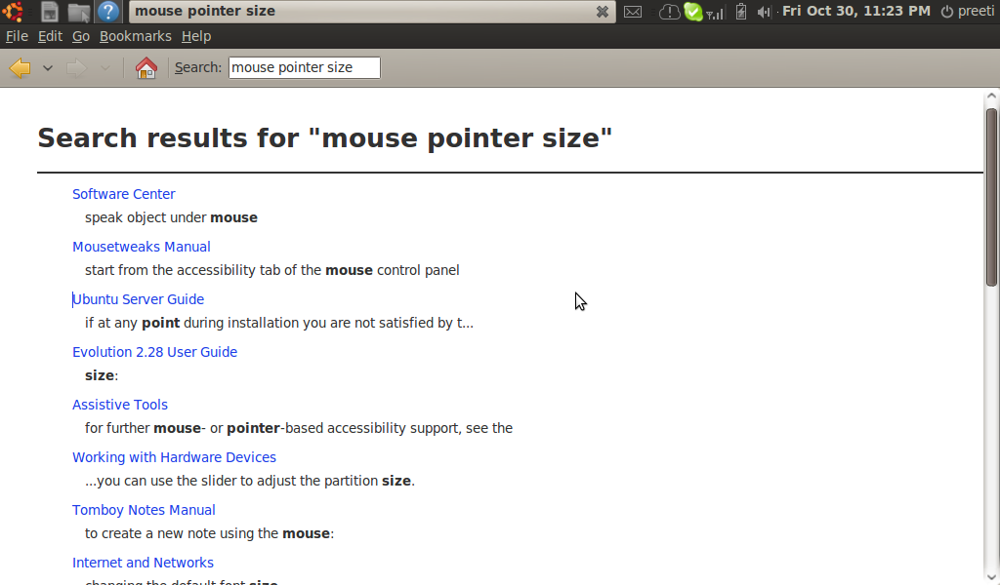](https://hitesh.in/wp-content/uploads/2009/10/mouse-help.png)\[/caption\]

\[caption id="attachment\_312" align="alignnone" width="586" caption="Same search on Google. The first link fixed the issue."\]\[/caption\]

## Final Thoughts

Although I have mostly highlighted deficiencies above, the truth is that it is a rock solid OS. I am very pleased with the polish that Ubuntu in general and particularly UNR has. The netbook feels fast and light. But the real test is when my sis uses it. Hope she leaves a comment soon.
