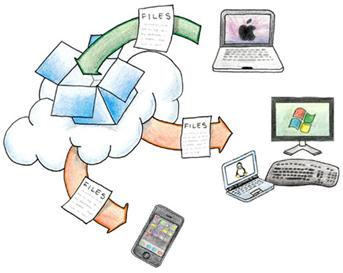

Well, I don't need to beat the dead horse about why one needs to backup data. But with the explosion of digital assets, it is all the more important.

### What are my digital assets?

The largest, of course, are photographs. Apart from these, I have a fair smattering of music, code, documents and others.

### How do I back them up?

Currently, photos are backed up on DVD and in the cloud (picasaweb). Picasa acts as incremental backup and DVDs are full backups. A copy in Hyderabad acts as offsite backup.

Other things lie around on 2 USB drives and [dropbox](http://getdropbox.com/), plus my disk drives in my PC and laptop.

### What other option have I tried?

I have tried a few backup tools, Windows 7 backup utility, some more apps on Ubuntu, and found everything lacking in one way or other. I haven't tried the Apple Time Machine or Windows Home Server. But, from what I have read, they might be answering most of my needs listed below, expect being cross platform. I have not spent much time trying online backup solutions because of the reasons mentioned earlier.

### Problems I face?

Synchronizing data is my biggest problem. Although, dropbox is great, I can't use it to backup my photos or music. In addition, I am afraid to plunge head long to an online storage system, since downloading all of them in India will be a real pain, not to mention, expensive.

### What will an ideal backup tool look like for me?

In a sentence, "Drop box on a (USB) stick".

### What was that again?

Well, let me expand. These are the list of features, if I were to write a backup tool, which I might do some day.

1. **Installation**: When I install the software (which was trivial in first place), it asks me only one question. What do I use the PC for, with a set of clear options (think big graphical buttons). Options include:

- Web surfing
- Home office
- Games
- Programming
- Creative work

1. **First Backup**: When I plug-in the external drive (big enough), it will prompt to use the disk for backup and then backs up all my important documents without me telling which are important.
2. **Sync and Restore**: The next time I plug-in the same drive, it does a silent sync, without bothering me. At the end of the backup process, if any of the files are removed locally, it will show me a friendly dialog allowing me to restore or permanently delete them.
3. **Multiple Computers**: I can use the same external drive to backup multiple PCs as well as sync multiple PCs running _multiple operating systems_. If a file exists on multiple PCs, it will intelligently update the local copies on all computers to the latest version.
4. **Web Backup**: It can back up the most important files to several web backup providers.
5. **Self contained**: Ideally the software should copy itself to the external disk and sets itself to auto run. Thus if the disk is plugged in to another PC, it could simply start the sync process without the need to install the software first.
6. **Miscellaneous**: Burn DVD, restore older version, etc.

### What next?

Don't know. May be I will write a utility when I get some free time, which is unlikely. Hopefully dropbox extend their sync over intranet to sync using disk. Maybe someone reads this writes such a tool. I am open to collaborate with a few like minded people in developing this. Maybe something in Java/Jython/JavaFX to keep it cross platform.
