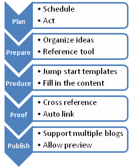

If there was ever a totally unqualified opinion, here it is. A blogger for 6 weeks and change, this is my thought what a blogging tool should be.

Those who came here searching for the ultimate editor, I am sorry to disappoint, only ideas here.

To start with; I have tried Wordpress online editor, [Scribefire](https://addons.mozilla.org/en-US/firefox/addon/1730), [Windows Live Writer](http://download.live.com/writer) and [Drivel](http://dropline.net/drivel/); and found them all lacking in one aspect or another. Currently I find Live Writer to be better than the rest. Trying out OneNote which has few features I like.

So, having laid the foundation, here are the features I would like to see in a blog editor.

- Allow you to plan and schedule posts
- Help to collect and organise ideas
- Integrated RSS reader
- Darkroom to allow focussed editing
- Post templates
- Allow easy formatting, preferable Textile or Markdown formatting
    
    - Advanced source code formatting ability
- Automatically cross reference posts
- Suggest related content

Let me try and expand that, and also the reason for them being there. Well to start with I thought of the workflow behind blogging. This involves planning, preparing, producing, proofing and publishing.

### Planning

Given that I made a promise to self, to post an article each week, I would prefer to be able to plan and schedule my articles. So an integrated calendar that shows my past posts and future ideas / drafts will help a lot.

### Preparing

Personally I use delicious to organize content and ideas. In fact I tag all stuff I will like to blog about. So I need an editor that can pull my delicious bookmarks and keep them readily accessible. I could then lookup all my 'toblog' bookmarks and develop what catches my fancy. My bookmarks also act as my reference tool.

In addition, if the editor has an integrated RSS reader, it will complete the content discovery part of the workflow. Throw in a quick 'blog this' action, and that would be great.

### Producing

So we have planned our posts, gathered all reference material and have a blog dancing in our head. The next step is to jot it all down. To add structure to this very creative process, I need a wizard. So when I click 'New Post' a wizard pops up showing a list of available templates. For example, I could have a Q&A template for my Entrepreneur's Series. Refer this post of [20 post templates.](http://www.problogger.net/archives/2005/11/29/20-types-of-blog-posts-battling-bloggers-block/) Based on my selection, the tool will create a pre-formatted text, thus giving a structure to my thoughts. Needless to say the templates library itself is editable.

While writing, it would be great to minimize distraction, so a [darkroom](http://they.misled.us/dark-room) option will be great. In addition, ability to use textile / markdown formatting will be wonderful.

In addition the editor needs to have decent support for inserting media, images etc. A light weight imager editor will be most welcome.

### Proofing

Once the post is near complete, it is time to shine it. In addition to the standard features like spell and grammar checks, it should have interlinking facility, which is the backbone of the internet. So I will like that the editor parses the post in the background and pulls up a list of related posts, like [Zemanta](http://www.zemanta.com/). In addition it should automatically link to all known words. For example, it should automatically insert a link to Zemanta, in the previous sentence. While it is doing this, it would have figured out the tags related to this post and added them as well. In fact if it has figured out the tags, finding related posts is as simple as looking up my delicious bookmarks with similar tags.

### Publishing

The final step is publishing, which is something each editor is able to do. Live Writer does it best as it can show a live preview, to the facility is completely optional.

So, what do you think? What's your workflow and editor of choice?

P.S. I have written this post on Word 2007. So far, this looks good in the producing and publishing department.
