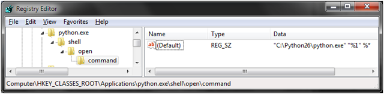

Spent the last week picking up Python and Django. Notes to self and anyone else who wants a quick start on Python/Django on Windows. Most Linux flavours already come with most tools needed for python development.

### Requirements:

- Installed [ActivePython 2.6](http://downloads.activestate.com/ActivePython/windows/2.6/ActivePython-2.6.4.8-win32-x86.msi)
- Installed [Komodo Edit](http://downloads.activestate.com/Komodo/releases/5.2.3/Komodo-Edit-5.2.3-4312.msi)
- Installed [Python Win32 Extensions](http://sourceforge.net/projects/pywin32/files/) (not sure why, but was recommended in some blog post and the project itself does not say much of what it does. Stuff like this gives me the heebie-jeebies.)
- Installed [Pinax](http://downloads.pinaxproject.com/Pinax-0.7.1-bundle.zip), which in turn installed Django.
- Installed [PyQt4](http://www.riverbankcomputing.com/software/pyqt/download)
- Installed [Eric4](http://eric-ide.python-projects.org/eric4-download.html) (uninstalled after using it for 10 minutes)

### Problems faced:

- Pinax installation was a bit flawed, it could not install all dependencies. Worked around by manually installing (pip install else easy\_install)
- Windows 7 was not passing command line arguments to .py scripts. Had to hack registry and add **%\*** to the end to make it work. See the Key and value below.

### Getting started:

**Python**: Like everyone else, I followed and recommend ['Dive Into Python'](http://diveintopython.org/toc/index.html). But more importantly, this [page of titbits](http://diveintopython.org/appendix/tips.html) is amazing extract from the book and quickly brings a Java dev up to speed. I should blog about 'Python for Java developers'. Time spent 4 hrs.

**Pinax**: Stopped at the [installation step](http://pinaxproject.com/docs/0.7/install.html). Will delve further after understanding Django better.

**Django**: Followed [the tutorial](http://docs.djangoproject.com/en/dev/intro/tutorial01/), then the [Django Book](http://www.djangobook.com/), and finally the [Django Docs](http://docs.djangoproject.com/en/dev/) for a deep dive. Time spent 8 hrs.

Django is surely one on the best documented project and also very straight forward. It suits my style of writing code and I did not feel like giving up in few hours, like the experience I had with RoR. Will surely blog about Django more.
