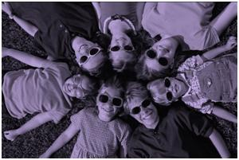

Stephen R. Covey in his landmark book "7 Habits of Highly Effective People" defines 9 possible centres that people have:

- Spouse-centred
- Friends / Enemy-centred
- Family-centred
- Money-centred
- Work-centred
- Possession - centred
- Pleasure-centred
- Church-centred
- Self-centred

In other words, these are the glasses we see the world through. All decision making is coloured by your bias towards one or more of these. But none of these are worth centring ones life around, they all blur the view. So he suggests taking off these glasses and seeing the world in the light of the principles that you value. If one has a mission statement and knows the principles he values most, then making decisions is easier.
