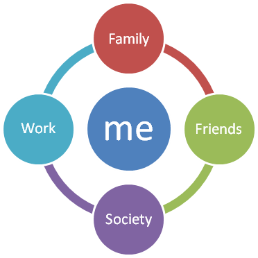

As hinted in the previous post I will take a departure from my general blogging topics and talk about life. Let me talk about something that troubled me and still slightly troubling me. 

I have been under a lot of mental and emotional stress lately, and did not know the reason. But with a lot of introspection and a couple of very good reads, I was able to find the root cause of this and am in a much better state of mind. Ask my wife ;) I will like to share this to spread the good words that helped me.

So, what was wrong?

## Personal Mission Statement

When I entered formal work life, my HR helped me frame my personal mission statement, or in fact how would I like to be remembered when I leave the world. It came naturally to me: "_The Guy who made a difference._" and I try to live my life towards this goal - "_Make a difference in every role I play_"

Let's first speak of the roles we play in life. Typically one plays several roles in life. A few play more, a few play less.

- Individual
- Family person - Child, Spouse, Parent, Relative
- Learning - Student, Teacher
- Working - Sub-ordinate, Co-worker, Boss, Mentor
- Society - Friends, Community member, Citizen

And the challenge is to maintain a balance between the roles; otherwise one of the roles dominates the others. This is called the 'Work Life Balance', which according to me is a misnomer. It is about balancing the importance you accord to each role.

The reason for discontent was that I was doing a good job at work and had been struggling to think of way to make a difference in the community. I was trying to increase my circle of influence and was having a difficult time doing so. But more importantly, I was neglecting my other roles in pursuit of this singular role, especially the roles which got added after I started my career. I was not making a difference as a husband and later as a father. This caused a lot of internal turmoil and stress but I did not realise the root cause. Which in hindsight is obvious, I was not fulfilling my mission statement, my goal, and my reason for existence. When I realised this and also realised the many things under by control that I can do to make a real difference to my family, I was suddenly at peace.

I now have renewed energy, a renewed sense of purpose and actively looking at ways to justify my role as a family member.

Community will come next; meanwhile I am working at growing my circle of influence to get to a position to be able to make a difference to the community.

So let me ask you this:

- What roles do you play?
- Are you justifying all the roles or is one role far bigger than the rest?
- Would you like to be remembered as?
    
    - A great worker
    - A great spouse
    - A great parent
    - A great child
    - All of the above - and above all, a great person
- Are you spending your time to achieve the above?

Related Read:

This article greatly inspired me: [http://steveblank.com/2009/06/18/epitaph-for-an-entrepreneur/](http://steveblank.com/2009/06/18/epitaph-for-an-entrepreneur/)
