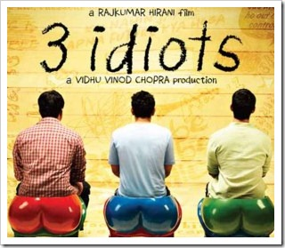

 I watched 3 Idiots yesterday, and could not resist reviewing it. This review is not about how great the movie is. There are [several of those](http://www.google.co.in/search?q=3+idiots+review) on the net.

Let me be quick in saying that my family and I loved the film and think it is one of the best movie. It is a good take on the state of education in the country, a subject I feel strongly about. This is also not about Chetan Bhagat, although the nit-picking could apply to Five Point Someone as well. But I haven't read it, so can't say.

### I expected more from Aamir, the perfectionist.

I was born in 1978, the same year that Farhan Qureshi (Madhavan) was born. So I felt more connected to the movie than the current generation. This also means that the college period depicted in the movie was the same period I was in college, which is roughly 1995-1999.

### So what?

Well you see, a few of the things shown in the movie are, let's say, futuristic.

#### Mobile Phones

Mobile phones were launched in India after 1994. The call charges in a 'scheme' were 16 Rs. incoming/outgoing. They were not mainstream until 2000 when charges began to drop. Even then, in 2000, I was the only one in my MBA college to have a mobile phone, and that too was given to me by my employer.

So showing engineering college students carrying a phone, pre 1999, was a bit of a stretch.

#### Mobile Internet

Even if you think 'chote' (Rancho) was rich enough to carry a mobile, the movie shows mobile internet being used in the hospital for video conferencing.

- Internet in 1999 was the good old modem based dialup internet at blazing speeds of 56 kbps. Broadband Internet was unheard of until 2005.
- Mobile Data Cards / USB Modems were launched in 2008/2009.
- Even then, I don't think the speed that Airtel EDGE gives is insufficient for video conferencing. I don't know for sure, since I am not using one.

#### Scooter

The scooter that Pia (Kareena) drives looks most certainly like Kinetic Flyte, which was only [launched in 2009](http://autonewsjunction.blogspot.com/2009/05/mahindra-kinetic-flyte-125cc-scooter.html).

#### Bottomline

With a little research, which Aamir Khan is known for, the film could have been more realistic. Anyways, if you haven't seen the movie, please do, it is really good.

_P.S. Happy New Year._
