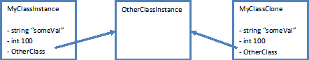

## Why Clone

In this world of concurrent, multi-threaded programming, functional style of programming makes more sense. And one of the key tenets of functional programming is immutability. Even in OO languages, a few benefits of FP can be derived if the objects are made immutable.

## Clone gone wrong

We follow a similar approach in our application. But this is not always possible, especially the mutable by default approach of Java. To overcome this, we pass around clones of instances, instead of the instance itself. This works in most cases, but we experienced a very subtle bug last week, where one thread was changing the values on a clone held by another thread, in spite of having no reference to it.

## The cause

After lot of disbelief and head scratching, the reason was there, right in front. We were calling the instance.clone() to create a clone. The clone function defined in the Object class (more or less) takes each variable and makes a copy if it and assigns it to the variable of the new instance. This works great for stack variable, but the for the ones on the heap, only the reference is copied, in effect both the clones have reference to the same instance of the member variable. In other words, it does a shallow copy and you might actually need a deep copy sometimes.

**Before Clone**

**After Clone**

## The effect

Thus any change made to MyClassInstance.OtherClass after MyClassClone was created also changes the MyClassClone.OtherClass, leading to confusing side effects.

## The solution

Once the problem is understood, the solution is obvious. Just override the clone method and clone any reference classes in it.

Check [http://stackoverflow.com/questions/2890340/question-about-cloning-in-java](http://stackoverflow.com/questions/2890340/question-about-cloning-in-java) for more.
