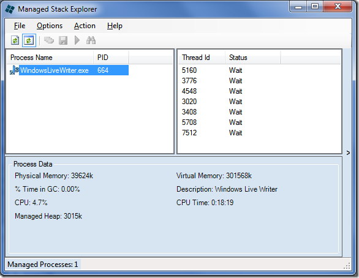

Multi-threaded Java practitioners know about the indispensible ways to taking thread dumps to see a snapshot of what's happening in the JVM, and resolve 'hang' issues. There are plethora of options, ranging from simple command line tools and utilities to nice GUI applications to writing some code in your application. A sampling of such options:

### Stack trace in Java

#### Command Line

If the application is running as a console application, you can try one of these:

**Sending a signal to the Java Virtual Machine**

On UNIX platforms you can send a signal to a program by using the kill command. This is the quit signal, which is handled by the JVM. For example, on Solaris you can use the command `kill -QUIT process_id`, where process\_id is the process number of your Java program.

Alternatively you can enter the key sequence `<ctrl>\` in the window where the Java program was started. Sending this signal instructs a signal handler in the JVM, to recursively print out all the information on the threads and monitors inside the JVM.

To generate a stack trace on Windows, enter the key sequence `<ctrl><break>` in the window where the Java program is running, or click the Close button on the window. (Excerpt from [http://java.sun.com/developer/technicalArticles/Programming/Stacktrace/](http://java.sun.com/developer/technicalArticles/Programming/Stacktrace/))

If the application is not running in a console, you can use the [jstack](http://download.oracle.com/javase/1.5.0/docs/tooldocs/share/jstack.html) tool that ships with J2EE since 1.5

**jstack** \[ option \] pid
**jstack** \[ option \] executable core
**jstack** \[ option \] \[server-id@\]remote-hostname-or-IP

#### GUI Tools

Since the JVM provides APIs to hook in and get the thread state and other information, there are several tools in the market that allows you to see the state of the running application including the thread stack trace. One such freely available option is [VisualVM](http://download-llnw.oracle.com/javase/6/docs/technotes/guides/visualvm/index.html). In fact it ships with JDK these days. Although VisualVM is pretty self explanatory, here are some instructions to get you started. [http://docs.oracle.com/javase/6/docs/technotes/guides/visualvm/threads.html](http://docs.oracle.com/javase/6/docs/technotes/guides/visualvm/threads.html)

 in thread dump sub-tab")

You could also use jConsole for similar purpose, but I prefer VisualVM. Check this for more information: [http://java.sun.com/developer/technicalArticles/J2SE/jconsole.html#DeadlockDetection](http://java.sun.com/developer/technicalArticles/J2SE/jconsole.html#DeadlockDetection)

#### Programmatically capturing the stack trace

from within an appilcation, you can call : [Thread.getAllStackTraces()](http://download.oracle.com/javase/1.5.0/docs/api/java/lang/Thread.html#getStackTrace()). But if you want to do the same from a different application, [ThreadMXBean](http://download.oracle.com/javase/6/docs/api/java/lang/management/ThreadMXBean.html) exposes the needed data, which can be retrieved by using the [JMX interface](http://download.oracle.com/javase/1.5.0/docs/api/java/lang/management/ManagementFactory.html).

### Dumping thread Stack trace in .NET

.NET does not seem to have the variety of options like Java. The only reasonable option I have seen so far is the [Managed Stack Explorer](http://www.codeplex.com/wikipage?ProjectName=MSE). This can be run from the command line as

mse /s /p <pid>

or as a GUI application:

Since it is an open source (MSPL) project, I took a peek into its source to check the API used. It depends on some sample code released by the CLR Team called [mdbg](http://www.microsoft.com/downloads/details.aspx?familyid=38449a42-6b7a-4e28-80ce-c55645ab1310&displaylang=en). This in turn is a managed layer on the unmanaged [CLR Debugging Services API](http://msdn.microsoft.com/en-us/library/bb397953.aspx).

From what I see there seems to be no direct way to get a stack trace in .NET, apart from either using the debugger API, or rolling your own on top of the [StackTrace](http://msdn.microsoft.com/en-us/library/system.diagnostics.stacktrace.aspx) class. Check [this question on StackOverflow](http://stackoverflow.com/questions/51768/print-stack-trace-information-from-c).
