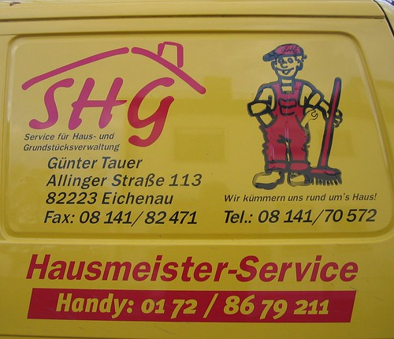

Thanks to the company I keep, online and offline, the only entrepreneurial ventures I see are tech related. Everyone wants to be the next viral sensation and make pots of money. Hardly anyone wants to add real value to the life of others and improve the community as a whole.

Rant aside, I recently came across a very interesting piece from Vivek Wadhwa titled [Replicators, Innovators, and Bill Gates](http://techcrunch.com/2010/03/06/replicators-innovators-and-bill-gates/). The form of ventures I described above might be of innovative type, but there is no harm in starting a replicating venture. Especially if it brings in a steady stream of income and gives stable employment to a few people.

One such service I see in Germany which can be easily replicated in India is the _'Hausmeister'_, literally a _house master_ service. For a fixed fee from each resident, a company takes care of all the common issues with a housing apartment. Whether it is cleaning, sanitation, repairs and other forms of maintenance.

With the several million apartment complexes in India, this service could organise and streamline the 'building maintenance' nightmare and make decent money, while generating employment for several people of varied skills. People who desperately need a job that they can do with dignity.

The occupants also gain as they have _one throat to choke_ and do not need to deal individually with a number of service providers. The last such venture I saw, was the greatly successful _cable wallah_. No reason similarly spirited individuals can't make this service a success too.
