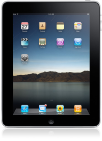

Ever since the iPad was announced, the internet is clogged with updates, analysis and impressions on iPad. But I saw very little talked about what this means, or how this could affect the way we do business. The guys with the biggest megaphones are either reporters or tech gurus, who are far removed from the trenches of enterprise application development.

### Full disclosure

The only Apple product I own is the iPod touch. It rocks, itunes sucks.

### Initial impressions

I was a bit underwhelmed and I doubt I will acquire an iPad. But that does not stop me from believing that it will be a big hit.

### What could be better?

Personally, I would have loved the device if it came with multi tasking and maybe a camera. But this post is not about it.

### Then what is it about?

This is about the big disruption the entire tablet computing movement could cause to the current state of art. How the relatively low price, the interactivity and the right size makes it suitable option in a lot of never before situations. And about how, Apple could leave a gaping hole for another Microsoft to capitalise on.

### How so?

By not allowing custom built apps from being installed on the iPad. This will rule out iPads adoption in the enterprises and also cool new ideas and mashups. Large companies could use an iPad for several clever niches, but needing to install custom IP on to the iPad via the app store is out of question.

### Are there any examples?

Sure, several.

- Team of financial advisors carrying a tablet for explain various insurance or investment options to average Joe. Imagine how good the apps could be made to look and how interactive they could be. It would go a long way in closing the sale.
- A restaurant replacing the boring menus with interactive ones on a tablet. Hell, they could even just 'add to basket' then and there. If there is a waiting time, people can pre-order their food and also surf while waiting.
- Replacing the dull and expensive kiosk with a 350$ tablet. This might still happen, but by playing a keynote presentation.
- How about the classic 'travelling salesman'? Does he really need a laptop?
- Medical staff carrying a tablet instead of the physical patient files.
- I haven't even begun to think about industrial applications

I think you get the picture. Not only can the tablet replace a laptop, but also paper in several cases. People more creative than me will find several more creative uses of a tablet. This brings me to mashups.

### What about them?

The thing about mashups, they are obvious in hind sight. But it takes a creative mind and an open ecosystem to dream and create one. But I can imagine a few hacks / mashups surly.

- How about a tablet controlled robot or speed boat?
- A tablet replacing the entire instrument panel of a car
- Tablets used in performing arts
- Tablets used in science and education
- Tablets used by NGOs in rural upliftment

The possibilities are limitless. But the artificial limitations imposed by Apple, will leave the door open for a highly hack-able, maybe android based, tablet provider. Whether that's a known brand like Asus, who spearheaded the netbook revolution; or an unknown startup like NotionInk remains to be seen.

Sure, Apple will sell millions of these devices and make tons of money, but saying that there is no room for another player is a false assumption.
