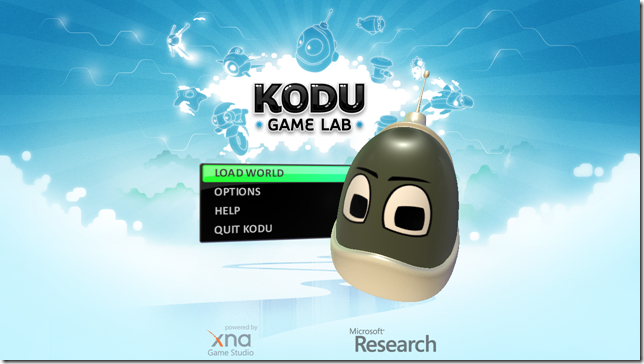

 We spent the long Easter weekend, lazing happily indoors since the weather did not permit going out. I wondered if the time could have been spent better, and started researching if my older daughter is old enough to start programming.

### Little background

My daughter will soon be six and she can use the computer very well for the usual tasks and I think she is a bit ahead of the curve, but that might just be a father speaking :)

The big bottleneck, I see, is her poor English skills. English not being our native tongue and she going to a German kindergarten, has limited her knowledge of English to a few words and phrases. Thus reading and writing code is going to be a challenge.

### Visual programming

Given the language 'handicap', I started looking out for what the best way to visually teach programming, which does not involve much reading and writing. A little research resulted in 3 options, 2 of which are old and I had come across and one that is pretty new.

#### Alice

[Alice](http://www.alice.org/) is project from Carnegie Mellon University, with a lot of industry backing. It is quite mature, but does not seem to be actively developed. for example Alice 3.0 is under development for over 4 years and still in a beta state. The recommended documentation is to buy the 'Learning to Program with Alice' book.

In addition, it is targeted towards high school students, although and interesting, but unsupported side project, [Storytelling Alice](http://www.alice.org/kelleher/storytelling/index.html) is targeted towards younger children.

For now, I have decided to give it a slip and will revisit once Alice 3.0 is more stable.

#### Scratch

[Scratch](http://scratch.mit.edu/) is a project from MIT. It has a smaller learning curve, but is more limited compared to Alice. I _think_ it only supports 2D compared to 3D support from Alice. This makes it more approachable for younger kids. In addition there are tons of lesson plans, documentation and samples available. Scratch has built-in sharing and there are literally a million user submitted projects.

All in all, I think Scratch will be a good starting point for my daughter. But, there's more

#### Kodu

The latest entrant on the scene is [Kodu](http://fuse.microsoft.com/kodu/), a Microsoft Research project. originally written for Xbox as a meta game (a game builder), a technical preview for PC has recently being released. It is a very visually engaging and has a polished feel to it. Given that it is a fairly new project, the documentation is lacking, save for the in _game_ help and sample, and a few blog posts. Let's see how it goes. There is always Scratch to fall back on.

##### And

Oh yes, there are a few more options, especially Logo and Lego Mindstorms NXT.
