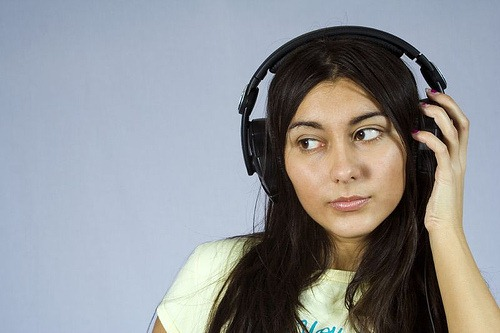
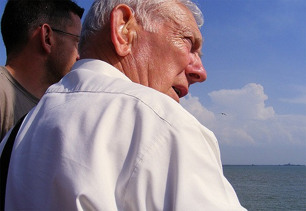
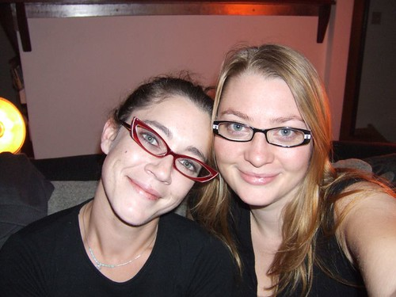
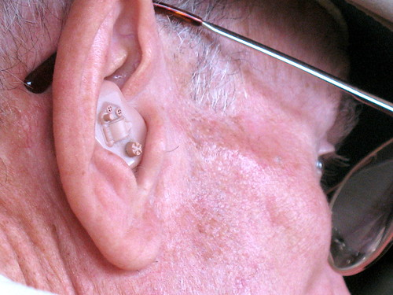

When we see a person, like the one below, nothing seems out of the ordinary.

Even if we come across the person below, hardly ever an eyebrow is raised, but

when we see him, something crosses our mind. Why is that? Because it's some form of impairment?

Then why don't similar thought cross our minds when we see this form of impairment?

Maybe because visual disability is so common, we have gotten used to it? In which case, should these be replaced

with something like this?

One thing to bear in mind, that hearing impairment will become common place as well, with everything around us getting louder, this is bound to happen. So get used to seeing more people with hearing aids on.
