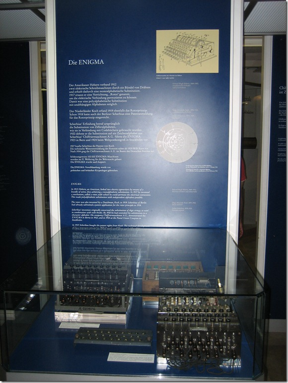
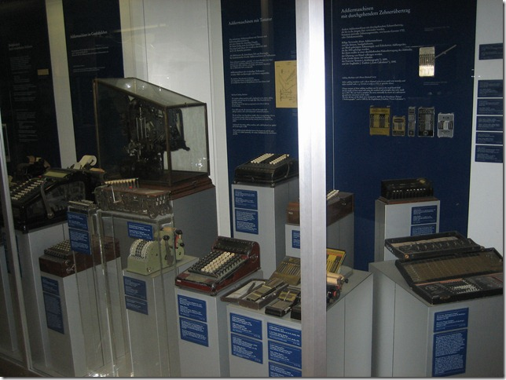
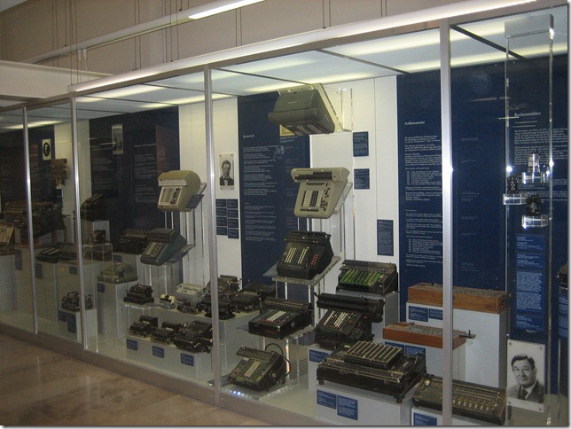
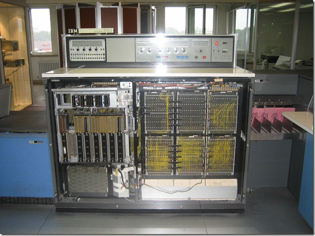
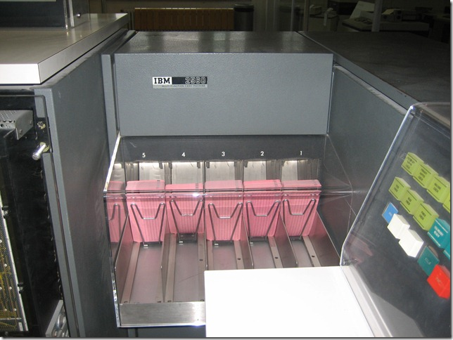
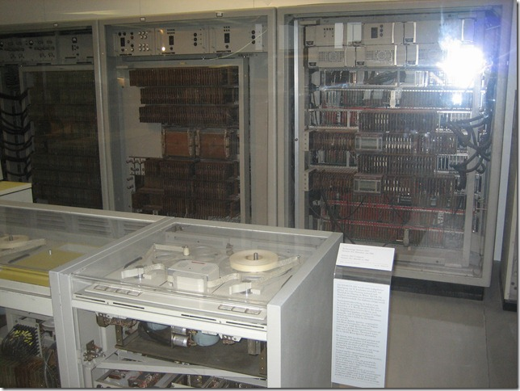
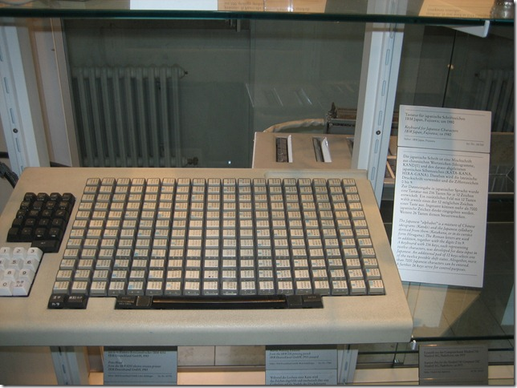
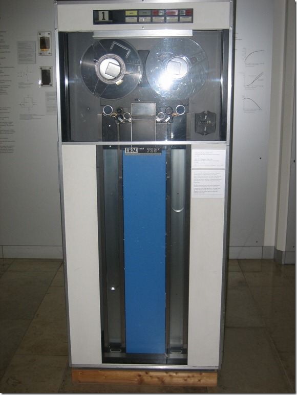

#### _where dead technologies go_

Some photos taken at the Technology Museum in Munich.

### The ENIGMA

One of the first crypto machine.

> An Enigma machine is any of a family of related electro-mechanical rotor machines used for the encryption and decryption of secret messages. The first Enigma was invented by German engineer Arthur Scherbius at the end of World War I. This model and its variants were used commercially from the early 1920s, and adopted by military and government services of several countries - most notably by Nazi Germany before and during World War II.
> 
> \- [http://en.wikipedia.org/wiki/ENIGMA](http://en.wikipedia.org/wiki/ENIGMA)

### Random set of Keyboards

### Mechanical Calculators (Arithmometer)

> An Arithmometer or Arithmomtre was a mechanical calculator that could add and subtract directly and could perform long multiplications and divisions effectively by using a movable accumulator for the result. Patented in France by Thomas de Colmar in 1820 and manufactured from 1851 to 1915, it became the first commercially successful mechanical calculator. Its sturdy design gave it a strong reputation of reliability and accuracy and made it a key player in the move from human computers to calculating machines that took place during the second half of the 19th century.
> 
> \- [http://en.wikipedia.org/wiki/Arithmometer](http://en.wikipedia.org/wiki/Arithmometer)

### IBM System 360 (Mainframe)

> The IBM System/360 (S/360) was a mainframe computer system family first announced by IBM on April 7, 1964, and sold between 1964 and 1978. It was the first family of computers designed to cover the complete range of applications, from small to large, both commercial and scientific. The design made a clear distinction between architecture and implementation, allowing IBM to release a suite of compatible designs at different prices. All but the most expensive systems used microcode to implement the instruction set, which featured 8-bit byte addressing and binary, decimal and floating-point calculations.
> 
> \- [http://en.wikipedia.org/wiki/IBM\_System/360](http://en.wikipedia.org/wiki/IBM_System/360)

## IBM 2560

Multifunction card machine (reader/punch/interpreter/multi-hopper)

### Siemens 2002

**The Siemens 2002** was a transistor computers manufactured by Siemens & Halske.

In 1954 its development began. The first prototype was fisnished in 1956 and distrubutions started in 1959. The Siemens 2002 was manufactured until 1966.

The system used magnetic core memories as memory had as extension, a drum storage. Different peripheral devices could be attached such as paper tape devices, page printers, card equipment, magnetic tapes and high speed printers.

### Japanese Keyboard

### IBM 729 V - magnetic Tape Storage

> The IBM 729 Magnetic Tape Unit was IBM's iconic tape mass storage system from the late 1950s through the mid 1960s. Part of the IBM 7 track family of tape units, it was used on late 700, most 7000 and many 1400 series computers.
> 
> \- [http://en.wikipedia.org/wiki/IBM\_729](http://en.wikipedia.org/wiki/IBM_729)
