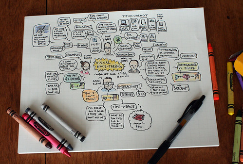

_and pencil for jotting ideas_

\[caption id="" align="alignnone" width="500" caption="Try that electronically!"\]\[/caption\]

A quick list of advantages of the good old way of taking notes:

- When ideas flow, only pencil can keep up with their speed.
- Doodling actually helps with the idea flow.
- Ideas are random, typing is linear.
- You can get away with drawing something on paper to depict a long sentence. Doing the same on a computer will mean sidetracking into finding a clipart.
- No pesky distractions, including those from the spelling or grammar checkers.
- My best UI design always starts on paper
- Easy to create mind maps.
- Paper is truly portable, I can take it anywhere.
- Only once I have all the thoughts on paper, do i try to organise them and make them _electronic_

How about you? What do you prefer, electronic or paper based note taking?

PS: I do like [freemind](http://freemind.sourceforge.net/wiki/index.php/Main_Page) when I am in mood for electronic note taking.
