It's been over 6 months, and Windows 7 still surprises me, pleasantly. The last time I felt the same about Windows was in 1995. Let me share a few things I found, which are generally not discussed.

Note: I never used Vista, so if some of these were present in Vista, I wouldn't know.

### The Windows Explorer

I think the explorer has seen the most refinement, there are nice things in all corners. My favourite features:

#### Pin to Windows Explorer

You might have heard about 'pin to task bar', but did you know that you can pin to windows explorer, which adds a folder to the Windows Explorer task bar shortcuts jump list. Wow, those were too many words but still doesn't explain it right, so here's a picture instead.

##### Drag a folder to the task bar

[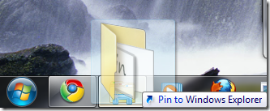](https://hitesh.in/wp-content/uploads/2010/02/image.png)

##### And the folder shows up in the jump list

(right click on the icon)

[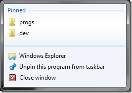](https://hitesh.in/wp-content/uploads/2010/02/image1.png)

#### Favourites

Although favourites were available in even WinXP, Win7 makes improves them.

To add something to favourites, just drag it into favourites

[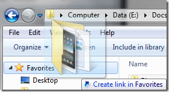](https://hitesh.in/wp-content/uploads/2010/02/image2.png)

and it shows up in your favourites list.

[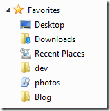](https://hitesh.in/wp-content/uploads/2010/02/image3.png)

Notice, the **photos** link in favourites? That brings me to the next feature:

#### Saved Search

This is a talked about feature, so I would not go in detail, just want to remind you that it exists, and please use it.

Libraries

This is by far my favourite feature. You can group a set of folders and call it a library. This make organising stuff so much easier. Out of box, Win 7 comes with 4 libraries, but it is trivial to add a new one.

[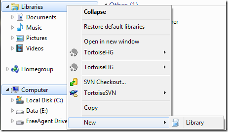](https://hitesh.in/wp-content/uploads/2010/02/image4.png)

Similarly, it is trivial to change a library, just right click -> properties and add/remove a folder to the library

[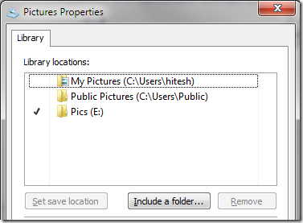](https://hitesh.in/wp-content/uploads/2010/02/image5.png)

Notice how Win 7 works with me instead of against me? Earlier it used to dump everything in My Documents\\My Pictures, whereas I prefer my pics in a different drive. Now I get the best of both worlds.

#### Rename is smarter

You can rename multiple files at once, just select them, rename 1, rename them all. BTW, undo works as well.

[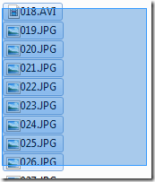](https://hitesh.in/wp-content/uploads/2010/02/image6.png) [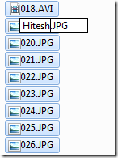](https://hitesh.in/wp-content/uploads/2010/02/image7.png)[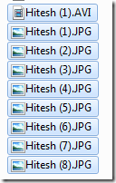](https://hitesh.in/wp-content/uploads/2010/02/image8.png)

And thankfully, only the filename is highlighted on rename, not the extension. Thus you just overwrite the name without needing to retype the extension. Win 7 seems to be catching up with Linux :)

One more thing, if you into the rename area, all junk characters will be stripped and the remaining will be used as the new file name.

#### Other refinements

Explorer lets you view stuff the way you want to:

[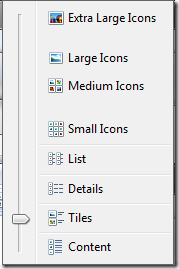](https://hitesh.in/wp-content/uploads/2010/02/image9.png) [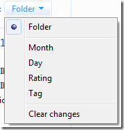](https://hitesh.in/wp-content/uploads/2010/02/image10.png)

[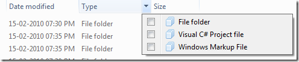](https://hitesh.in/wp-content/uploads/2010/02/image11.png)

### Window Manager

Everyone who used Win7 would have soon discovered that dragging a window to the left or right edge of the screen resize the window to take up half screen, or that dragging it to the top makes it a full screen window. But there are a few difficult to discover shortcuts:

<table border="0" cellspacing="0" cellpadding="2" width="400"><tbody><tr><td width="133" valign="top">Action</td><td width="133" valign="top">Mouse shortcut</td><td width="133" valign="top">Keyboard shortcut</td></tr><tr><td width="133" valign="top">Resize to fill left half of screen</td><td width="133" valign="top">drag window to left edge</td><td width="133" valign="top">Win + left arrow</td></tr><tr><td width="133" valign="top">Resize to fill right half of screen</td><td width="133" valign="top">drag window to right edge</td><td width="133" valign="top">Win + right arrow</td></tr><tr><td width="133" valign="top">Maximise</td><td width="133" valign="top">drag window to top edge</td><td width="133" valign="top">Win + up arrow</td></tr><tr><td width="133" valign="top">Make window as tall as the screen</td><td width="133" valign="top">double click top / bottom border</td><td width="133" valign="top"></td></tr><tr><td width="133" valign="top">Minimize window</td><td width="133" valign="top">click the minimize button ;)</td><td width="133" valign="top">Win + down arror</td></tr><tr><td width="133" valign="top">Show desktop</td><td width="133" valign="top">Click the bottom right corner</td><td width="133" valign="top">Win + D</td></tr></tbody></table>

### The clock

The clock seems to be another area which got a complete makeover. People were used to double clicking the clock to check the calendar. But this needed admin privileges since the calendar was for _setting_ date, not _getting_ it. Now the clock supports this use case really well. Some additional features:

#### Additional clocks

Finally Windows has entered the inter-connected world.

You can add more clock by going to the Date and Time settings.

[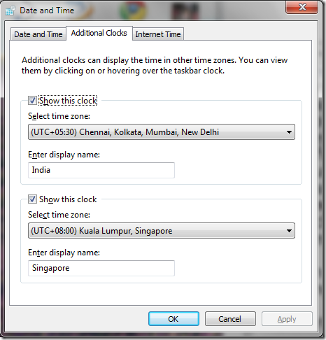](https://hitesh.in/wp-content/uploads/2010/02/image12.png)

Now a mouse over the clock will reveal the additional times as well:

[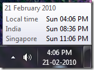](https://hitesh.in/wp-content/uploads/2010/02/image13.png)

A click is even better

[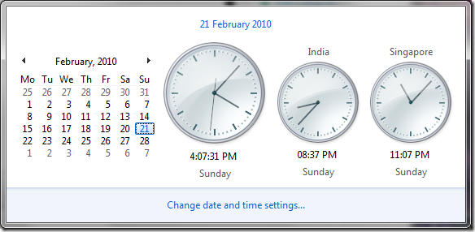](https://hitesh.in/wp-content/uploads/2010/02/image14.png)

#### Zoom in / out

Clicking the month (February, 2010 in above screenshot) will zoom out to this year then decade and finally the century:

[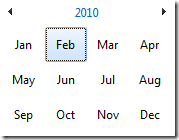](https://hitesh.in/wp-content/uploads/2010/02/image15.png) [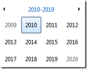](https://hitesh.in/wp-content/uploads/2010/02/image16.png) [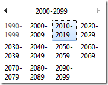](https://hitesh.in/wp-content/uploads/2010/02/image17.png)

Clicking on any of the 'table cells' will zoom you back in.

#### Desktop Zoom

Talking about zoom, did you know that turning the mouse wheel while holding the 'control' key will make the icons on the desktop smaller / bigger?

### Other Applications

Win 7 has some good new apps and some refinement in older apps. A few applications worth a mention

**Snipping Tool**: Finally a screen capture tool

**Paint**: Although still lacking, it is at least not as bad as earlier. Some decent brushes and ability to save in multiple formats.

**Media Player**: Finally ships with decent codecs

Games: A few new games and improvements to the earlier ones.

**Notepad**: nothing to see here, move on :)

### And finally

What started out as a short post grew quite large. If you have some tips, please leave a comment below.
