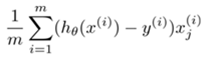

Linear regression is a fancy name to a simple technique. This algorithm (model) predicts the most likely result (**y**) given the input features (**x**). To be able to predict, the model needs (lots of) historical data with the correct output (thus it is supervised learning).

This model finds weights (**θ**) to be assigned to each feature, such that sum of the weighted features is closest to the given answer **y**.

### Hypothesis

So given there are n features x0 to xn and the related weights θ0 to θn; the hypothesis is given as:

```
hθ(x) = θ0x0 + θ1x1 + ... + θnxn
```

If θ and x are stored as matrices, then the above can be represented as matrix multiplication and is called _vectorized implementation_. Vectorisation really speeds up the processing and was one of the big lessons on the entire ML class. The vectorized version of the above hypothesis is:

```
hθ(x) = θTx
```

### Cost function

So what remains is to find values of θ those results in the hypothesis predicting values that are _close_ to the correct value given.

There could be several definition of _close_, but the most accepted definition is _average squared error._ In other words it is the sum of the square of the difference between the actual value and the predicted value, divided by 2m where m is the total number of samples.

Vectorized version:

```
sumsq(θTx-y) / (2*m)
```

### Optimisation Algorithms

So far so good and here comes the difficult part. Now we are left with finding the values of theta which minimizes the above cost function. We could do this with trial and error, and maybe come up with an answer in a few years. Thankfully there are several algorithms developed by people much smarter than me and I could use their work to get the results. There were few approaches discussed in the class.

- Normal Equation
- Gradient Descent
- Advanced algorithms
    - Conjugate gradient (fminunc & fmincg)
    - BFGS, L-BFGS (just mentioned)

We mostly used gradient descent and fminunc / fmincg in the class, and both expect a cost function that returns the cost and the gradient.

### Derivative of cost function (gradient)

The cost was defined above and the gradient for linear regression hypothesis is given as:



(for j = 0 to n)

Vectorized version:

```
X' * (X * theta - y) / m
```

### Implementation notes

Details will be covered in another post.

- Apply feature scaling
- Apply mean normalisation
- Add a new feature (x0) which is all ones
- It helps to visualize the data
- It helps plot the cost after each iteration
- There are several other practical tips given throughout the class, and I hope to blog about it as well.
