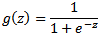
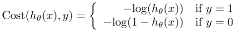
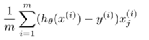

Logistic regression is used to classify things into positive case or negative case. It is a special case of linear regression which outputs value between 0 and 1, which denote the probability or the likelihood of the given sample being positive. For e.g. what is the probability of the given email being a spam?

We can then predict a positive case if the hypothesis outputs a value above a certain threshold, which normally is 0.5 but could be more or less. The ideal threshold can be derived based on the cross validation result. More on this in a later post.

### Hypothesis

As mentioned above, logistic regression is similar to linear regression, but the hypothesis always returns an output between 0 and 1. This is achieved by passing the hypothesis of the linear regression to a [Sigmoid function](http://en.wikipedia.org/wiki/Sigmoid_function). Thus the hypothesis is denoted as:

```
hθ(x) = g(θTx) 
```

where g is the sigmoid function defined as:



### Cost Function

The cost function for classification problems are a bit more involved due to the fact that simple squared error is not sufficient to work with the small differences here, since the max difference possible is 1, predictive 0% probability for a positive case. Therefore to magnify the differences a log scale is used.  Vectorized version:

```
J = sum(-y .* log(hypo) - (1-y).*log(1-hypo)) / -m
```

### Derivative of cost function (gradient)

The gradient for hypothesis is the same as that of linear regression:  The hypothesis of course is different as stated above.

## Multiclass Classification

So far we have only looked at 2 distinct results from the algorithm, either negative (y=0) or positive (y=1). But what if there are more than 2 distinct possibilities? This is covered under multi class or one-vs-all classification.

The basic idea is simple. We train the classifier once per each possible outcome. For e.g. If we need to predict if the given sentence is in English, German or French, we will derive the value of θ for each.

So the θ for English will be able to predict whether the sentence is in English or not, thus changing the problem to a single class (positive/negative) classification. Similarly the θ for German and French are derived.

Then for a given sentence we will calculate the probability of it being English, German or French and return the language having the highest probability.
