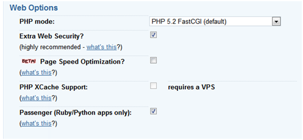

I wrote the [Stack Monthly](http://stackmonthly.com/) site on the one file [Bottle framework](http://bottlepy.org/), since my needs were really bare bones. But when I tried to get it running on Dreamhost, I had to struggle quite a lot, because there was no documentation to show how to do it.

Only past midnight, did it dawn on me that there is no documentation, because it is so darn simple! So as a note to self, and to save someone an hour or two, here's how to run a Bottle app on Dreamhost.

> **In a rush? Get the [code at github](https://gist.github.com/1023027).**

## Setup a domain

Follow the steps listed in the wiki, to setup [Python/Passenger support for a domain](http://wiki.dreamhost.com/Passenger).



## Create a passenger\_wsgi.py

This is where the Apache Passenger module hooks into our application. There are 4 steps needed to create this file.

### Set the path

All dreamhost documentation on python advises that you setup a virtual environment. Since bottle has no dependencies this is not needed. Instead just add the current directory, where bottle.py resides, into the system path.

```
import os, sys 
```

### Passenger hook method

```
def application(environ, start_response): 
```

### Write a main method

This will be used to run a development server, in debug mode and auto reload.

```
if __name__ == "__main__": 
```

### Write your application

Well, you will need to write your own application :)

```
@route('/') 
```

That's it, save it as passenger\_wsgi.py.

For local development, run it as

python passenger\_wsgi.py

on dreamhost, stuff will just happen.

## Additional notes

### Create restart.txt

To restart your application on dreamhost, run this command:

touch tmp/restart.txt

in the base folder, i.e. the parent of the public folder defined in the "Web directory" of the dreamhost domain setup.

### Server static files directly

It is better to let apache/passenger take care of serving static files. Any file found in the public directory will be served directly and bottle routing will not be called.

For local development, define routes to server static files out of public directory.

```
@route('/css/:file') 
```

Full code [listing on github](https://gist.github.com/1023027).
