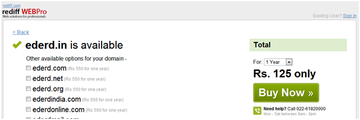
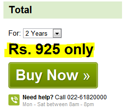
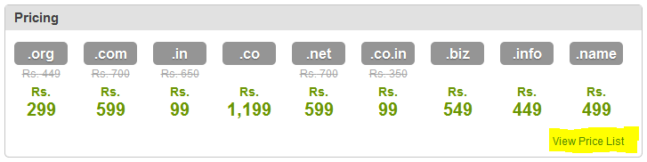

While visiting rediff.com today, I was intrigued by the home page promotion of 'Biz Solutions'. Clicking through, I was surprised to see an unbelievable price for .in domains. This sent me hunting for the fine print, but I found none. Here is a screenshot of the offer.

\[caption id="" align="alignnone" width="606" caption=".in - Rs. 125 for one year"\]\[/caption\]

Not ready to give up, I decided to test the offer by trying to purchase a dummy domain.

Still Rs. 125, still no fine print or renewal rates. Only when I changed the registration period to 2 years, could I tease out a probable year 2 rate.

So there you have it, rediff advertises a low-low price of Rs. 125, and never discloses that it will cost you Rs. 800 to renew.

I looked up 2 more alternates that target customers of similar skills, bigrock and yahoo. Both had the first year fees lower than renewals (industry trend I am fully aware of), but were upfront that the renewals rate differs. Yahoo was very upfront, whereas bigrock needed some digging.

\[caption id="" align="alignnone" width="295" caption="Yahoo's offer"\]\[/caption\]

\[caption id="" align="alignnone" width="727" caption="Bigrock's offer"\]\[/caption\]
