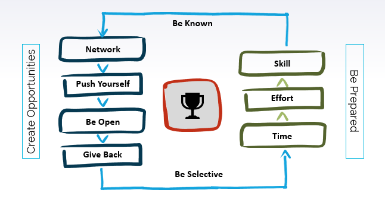

Recently, I was invited to share my experiences with my alma-mater. I chose to talk about how fresh graduates can maximize their career success.

While several people will ascribe their success or success of others to luck; it is also silently agreed that success is much more than luck. Therefore I prefer Roman philosopher Seneca's definition of luck.

> Luck is what happens when opportunity meets preparation.
> 
> Seneca

Therefore I focused on how one can increase their luck by working on creating opportunities and being prepared.

## The luck factory

Create your own luck, consistently.

### Create Opportunities

#### Network

> Networking that matters is helping people achieve their goals.
> 
> Seth Godin

- Create a strong network though out your academic life and career.
- Be aware of the strength of every individual.
- Help out others. It improves the strength of the connections.
- It is easy to help others, if you know them, their strengths and interests.
- Never burn bridges.

#### Push yourself

> You never change your life until you step out of your comfort zone; change begins at the end of your comfort zone.
> 
> Roy T. Bennett

- The most dangerous place to be in is the comfort zone. It kills luck.
- You can't sit under a tree and wait for an apple to fall in your hands while others will be already selling apples from those same trees.
- When you find yourself in a comfort zone, consciously come out of it. Talk to your manager, ask for a different challenge.
- Or seek out. Not for money but to break out of a comfort zone.

#### Be Open

> A pessimist sees the difficulty in every opportunity; an optimist sees the opportunity in every difficulty.
> 
> Winston Churchill

- Life happens, industries get disrupted. A pandemic like COVID-19 shuts down everything.
- But opportunities always arrive in disguise.
- Some companies and individual fare better than others. Because they are better prepared, and are open to change; to suggestions; to challenges.
- The are open to move out of the comfort zone and do something new
- Finally, never say or think ‘not my job’.

#### Give Back

> Life is a gift, and it offers us the privilege, opportunity, and responsibility to give something back by becoming more.
> 
> Tony Robbins

- Give back, help your network; like you will expect them to help you.
- Recommend. Refer. Connect. Share.
- And give back to the community, society, nation.
- The world is acknowledging _good karma_ and talking about _pay it forward_

### Being Prepared

#### Time

> When you kill time, you kill your opportunities for success.
> 
> Denis Waitley

- Have time; be disciplined with it.
- If you don't have time, you'll not be able to capitalize on an opportunity.
- Everything has an opportunity cost – doing something mean not doing something else. So be selective on what you do.

#### Hard Work

> Opportunity is missed by most people because it is dressed in overalls and looks like work.
> 
> \- Thomas A. Edison

- Work hard
- Take pride in your work
- Always give your best
- You’ll be known for these things

#### Skills

> I am a great believer in luck, and I find the harder I work the more I have of it.
> 
> Stephen Leacock

- You will develop skills with opportunities
- And you’ll get opportunities based on your skills
- Remember to say no to comfort zone and be open to challenges and learning
- And then apply / demonstrate your skills

### and finally..

#### Be Selective

- Remember that you have limited time and measure the opportunity cost.
- Be strategic on the things your work on, however not at the risk of being closed to new ideas and challenges.
- Be decisive. Once you have decided to do something, give it your 100%.

#### Be Known

- It's not about hyping yourself
- But also not in dark, you need to be noticed.
- What do you want to be known for? Build a narrative.
- Communicate consistent with the narrative.
- Use the social media properly to build your personal brand
