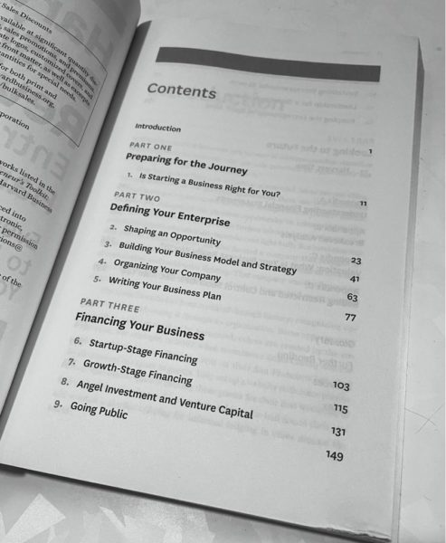

Every book on entrepreneurship seems to follow the same template.

- Research your market
- Do some Excel modelling
- Raise some money
- Start the business
- $$$

These are no longer relevant to the current environment, at least not relevant if you are looking to start a small business or a startup.

A better book (or video, or a course) would be along these lines:

1. **How to get a business idea.** The power of observation and second-order thinking.
2. **Building an MVP.** MVP is not limited to technology, it is something that lets you test your business idea in the real world.
3. **How to sell.** The difference between success and failure of a business is the ability to reach your customer and sell to them.
4. **How to market.** Marketing is the fuel that runs a sales machine. The ability to create a message that resonates with your ideal customer and to be able to deliver it to them is an art as much as it is science.
5. **How to scale.** When you have validated that the market is interested in your idea, the ability to scale the production, logistics, sales, and marketing as well as formalizing the operations - finance, accounting, customer service, partner management, and others.
6. **How to grow.** The strategies around growing the business beyond the original idea, and finding related business opportunities ensure business growth and continuity.
7. **How to exit.** Like starting a business, it is important to prepare your business for an exit.

What have I missed?
