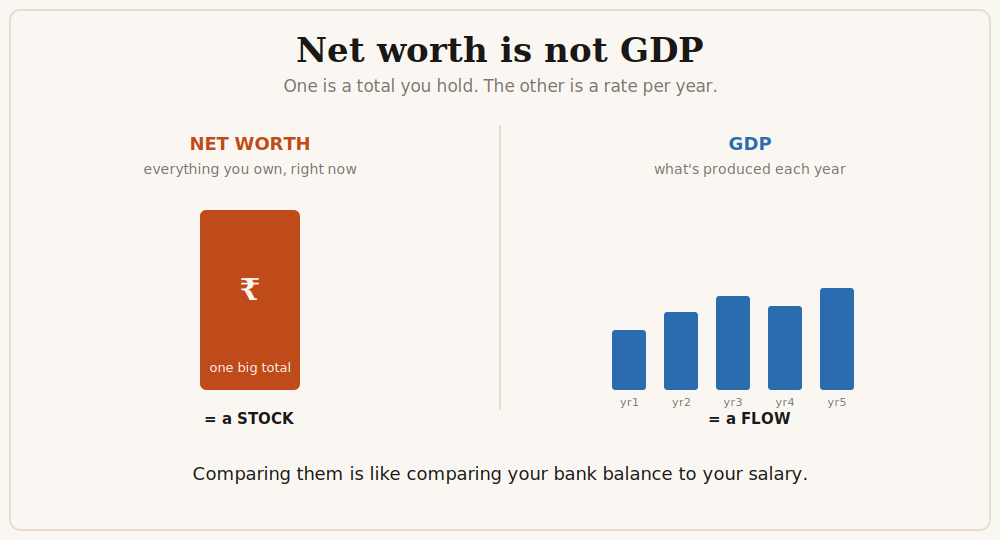
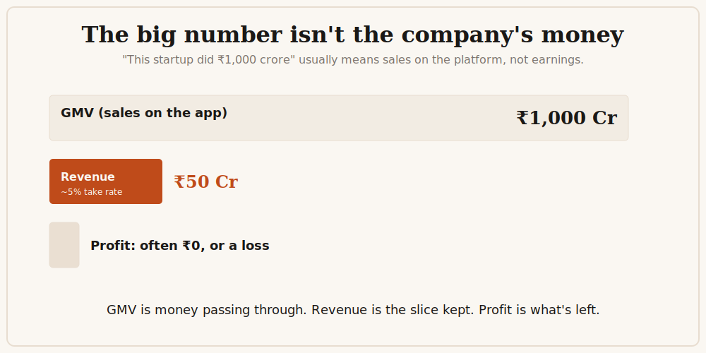
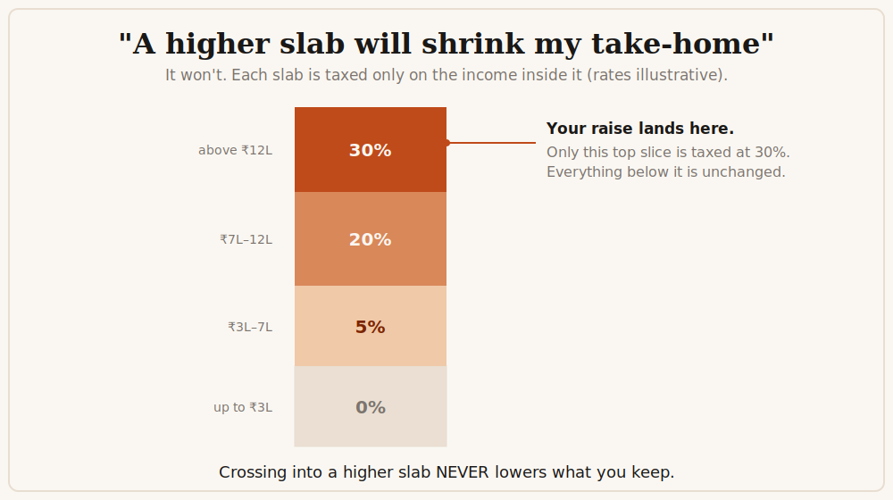
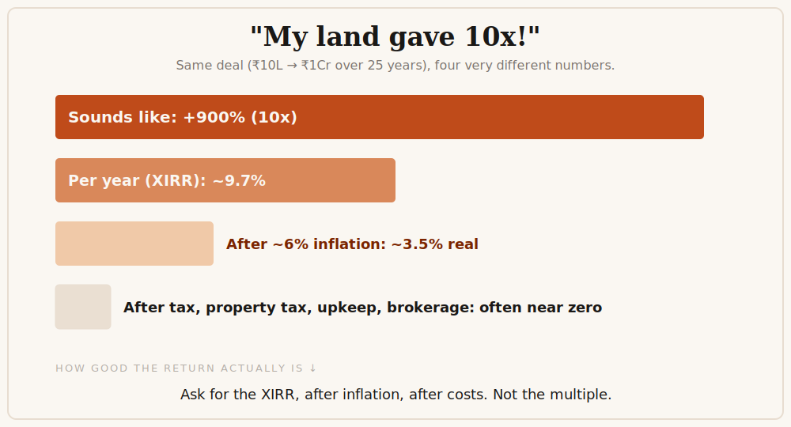

Every few weeks a chart goes viral: "this one person is now richer than the entire GDP of [some country]." It collects a hundred thousand likes, and it is comparing two numbers that cannot be compared. Net worth is a total, everything someone owns added up, today. GDP is a flow, everything a country produces in a single year. One is a bank balance, the other is a salary. Putting them side by side tells you nothing, except that whoever made the chart never stopped to ask what the numbers mean.

I see this constantly, and it is not really about that one chart. Almost every confident money take that does the rounds, the kind your favourite finance influencer posts between a motivational quote and an affiliate link, is built on one of a small handful of mix-ups. Learn to spot the four below and most of the noise stops working on you.

## 1. A total is not a yearly rate

Net worth versus GDP is the famous version, but this shows up everywhere. A country's total debt, built up over decades, gets compared to one year's tax collection. A person "worth fifty thousand crore" is discussed as if that is cash they can spend. It is not. That number is mostly the market value of shares they own, which exists on paper and would shrink the moment they tried to sell a big chunk. When a stock drops 10% and the headline says a founder "lost ten thousand crore today," no money actually went anywhere. It was never sitting in an account.

The quick test: is one number a snapshot (wealth, debt, the value of a company) and the other a per-year figure (GDP, income, revenue, the deficit)? If so, you cannot compare them, and you certainly cannot subtract one from the other.

## 2. The big number in the headline is usually not earnings

"This startup did ₹1,000 crore" almost never means it earned ₹1,000 crore. For most consumer apps that figure is GMV: the total value of everything sold on the platform. The company's actual revenue is a small cut of that, the "take rate," often around 5%. So ₹1,000 crore of GMV might be ₹50 crore of revenue. And revenue is not profit. After paying for everything, the profit can be zero or a loss. Three very different numbers, and the post quotes whichever one sounds biggest.

The same move has cousins. Revenue gets dressed up as "ARR" (the recurring part, annualised) even when a lot of it was one-time. Salaries get quoted as "CTC," a number that bundles in your provident fund, gratuity, and notional perks, so the money that actually lands in your account is meaningfully smaller. And a low-margin business like infrastructure or trading gets compared to a high-margin one like software purely on revenue, as if a rupee of sales meant the same thing in both.

## 3. How tax slabs actually work

This is the most expensive mix-up, because people make real decisions on it.

The headline one is slab panic: "don't take the raise, it will push me into a higher bracket and I will take home less." That is simply not how it works. Each slab is taxed only on the income that falls inside it. Your raise sits at the top, and only that top slice pays the higher rate. Everything below it is taxed exactly as before. Crossing into a higher slab never reduces your take-home. The chart above is the entire idea.

A few more from the same family:

**TDS and TCS are not money gone.** When tax is deducted at source, or that 20% is collected on a large foreign transfer or card spend, it feels like the money vanished. It did not. It is a prepayment of your own tax, set off when you file your return, and refunded if too much was taken. It is a cash-flow annoyance, not an expense.

**"GST on money I already paid income tax on is double taxation."** These are two different taxes on two different things: income when you earn it, consumption when you spend it. Irritating, but not the same rupee taxed twice. (And GST itself is not "tax on tax," because a business claims credit for the GST it already paid on its inputs.)

**"Start a business and write everything off."** A deduction only saves you tax at your rate, not the whole cost. Spending one rupee to save thirty paise is not free money.

**"The rich pay no tax."** This usually confuses legal tax planning with illegal evasion, and forgets that you are taxed when you sell an asset, not while it quietly rises in value on paper.

## 4. A multiple is not a return

"My land gave 10x!" sounds incredible. But over how long? If a ₹10 lakh plot became ₹1 crore over 25 years, that is about 9.7% a year, not 900%. The right tool is XIRR, which just tells you the annual rate of return after accounting for when money actually went in and came out. A ten-times gain over a long time is an ordinary annual return wearing a big costume.

Then subtract inflation. At roughly 6%, that 9.7% is closer to 3.5% in real terms, which is the part that grows your actual buying power. Now subtract what people forget with land: years of property tax and upkeep, no rent if the plot sat empty, brokerage, and the fact that you could not sell it the day you needed cash. The honest, after-everything return is often close to nothing, sometimes negative. The same trap hides in "this fund gave 30% average returns," because an average is not what you actually earned once losses and timing are counted.

The fix is one habit: when someone quotes a multiple, ask for the annual return, after inflation, after costs. Most impressive-sounding investments get a lot less impressive.

## The one question that does most of the work

None of this is hard, and none of it is CA-level finance. It is just refusing to be impressed by a number until you know what kind of number it is: a total or a rate, the headline or the take-home, the whole slab or the top slice, the multiple or the real annual return.

These takes do not spread because the people posting them are stupid. They spread because confidence travels faster than understanding, and a clean wrong number gets more engagement than a messy right one. So before you reshare the next jaw-dropping stat, ask the boring question: what does this number actually mean? Most of the time, that is enough to make the jaw un-drop.
