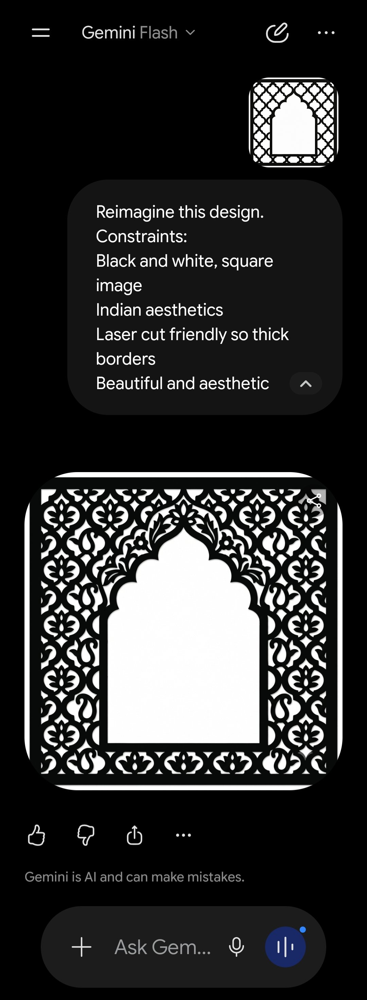
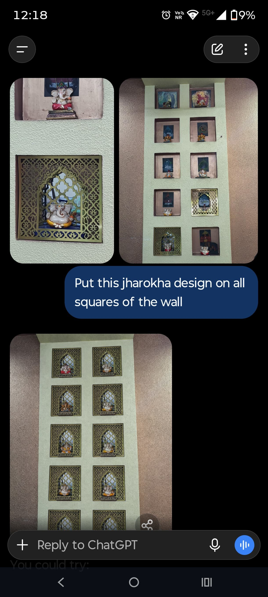
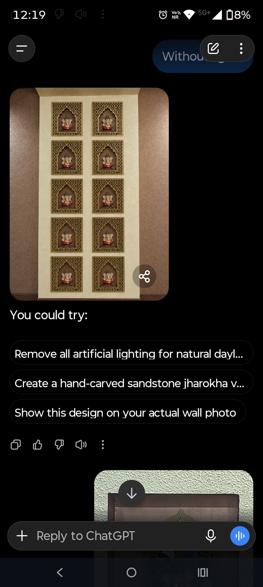
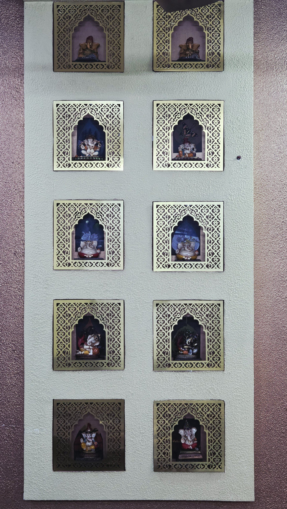

Happy Ganesh Chaturthi! A break from the usual AI-and-business posts today, just a small home project I had fun with.

We have a wall with ten square niches, built up over the years to hold Ganesha idols we've collected. It always looked a little bare, just plain cut-outs in the wall. I wanted a proper jharokha, the ornamental jaali frame you see on old havelis, around each one, but I had no design and no idea what it should look like.

So I started with Gemini. I gave it one instruction: reimagine a jharokha, black and white, square, Indian aesthetic, thick borders because it has to survive a laser cutter, and make it beautiful. It came back with a clean arched lattice on the first try, which honestly surprised me.

Not every version made the cut. At one point I tried a simpler quatrefoil lattice, cut one panel, mounted it on a single square, and asked ChatGPT to preview it across the rest of the wall. It looked decent, just not as striking as I wanted, so it stayed shortlisted and unused.

For the design I actually went with, I gave ChatGPT a photo of the jharokha pattern I liked along with a picture of my bare wall and asked it to put the design on all ten squares. First pass came back lit like a movie set, all warm gold.

I asked for the same thing without the artificial lighting, closer to how it would sit on a normal afternoon. That's the version I actually used to sign off on the design before booking the laser cutting.

Here's how it actually turned out, ten Ganeshas, ten jharokhas, cut and finished in brass.

What I liked about this wasn't the novelty, it was the sequence: idea, generate, preview on the real wall, only then commit to cutting metal. That's the part I'd actually reuse for anything physical.

Ganpati Bappa Morya, and happy Chaturthi to everyone reading. Back to the usual posts next week.
