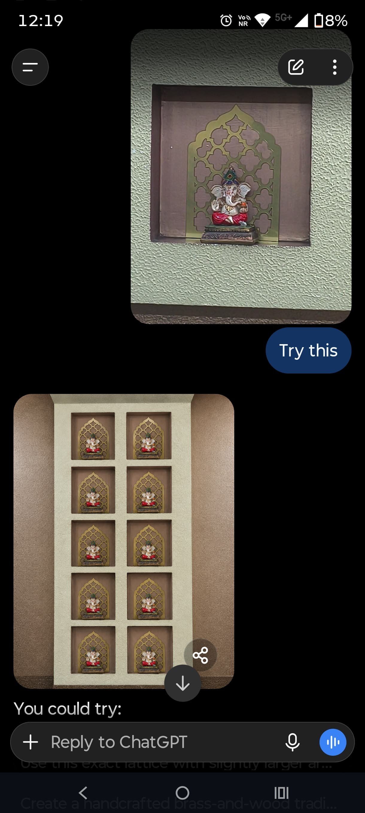

Happy Ganesh Chaturthi! A break from the usual AI-and-business posts today, just a small home project I had fun with.

We have a wall with ten square niches, built up over the years to hold Ganesha idols we've collected. It always looked a little bare, just plain cut-outs in the wall. I wanted a proper jharokha, the ornamental jaali frame you see on old havelis, around each one, but I had no design and no idea what it should look like.

So I started with Gemini. I gave it one instruction: reimagine a jharokha, black and white, square, Indian aesthetic, thick borders because it has to survive a laser cutter, and make it beautiful. It came back with a clean arched lattice on the first try, which honestly surprised me.

Before committing to cutting ten of these in brass, I wanted to see how it would actually sit on the wall. I cut and mounted just one, photographed it in place, and fed that photo to ChatGPT: try this on the rest. It generated a full mockup of the wall with the design repeated across all ten squares, close enough to the real thing that I could tell it would work before spending on nine more panels.

Here's how it actually turned out, ten Ganeshas, ten jharokhas, cut and finished in brass.

What I liked about this wasn't the novelty, it was the sequence: idea, generate, preview on the real wall, only then commit to cutting metal. That's the part I'd actually reuse for anything physical.

Ganpati Bappa Morya, and happy Chaturthi to everyone reading. Back to the usual posts next week.
